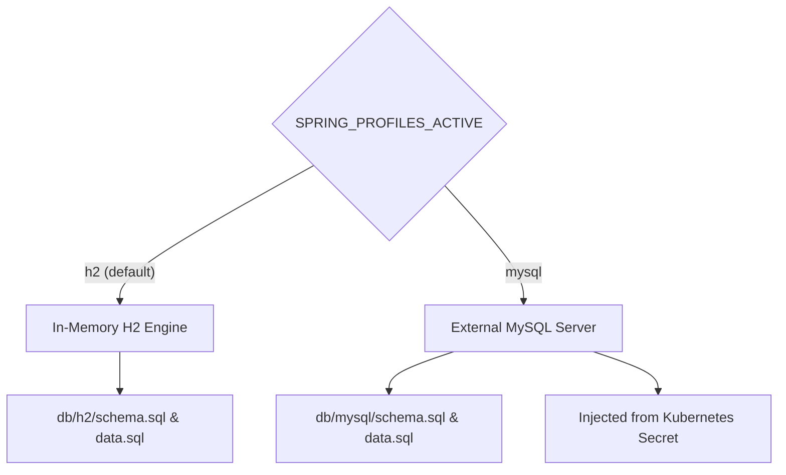
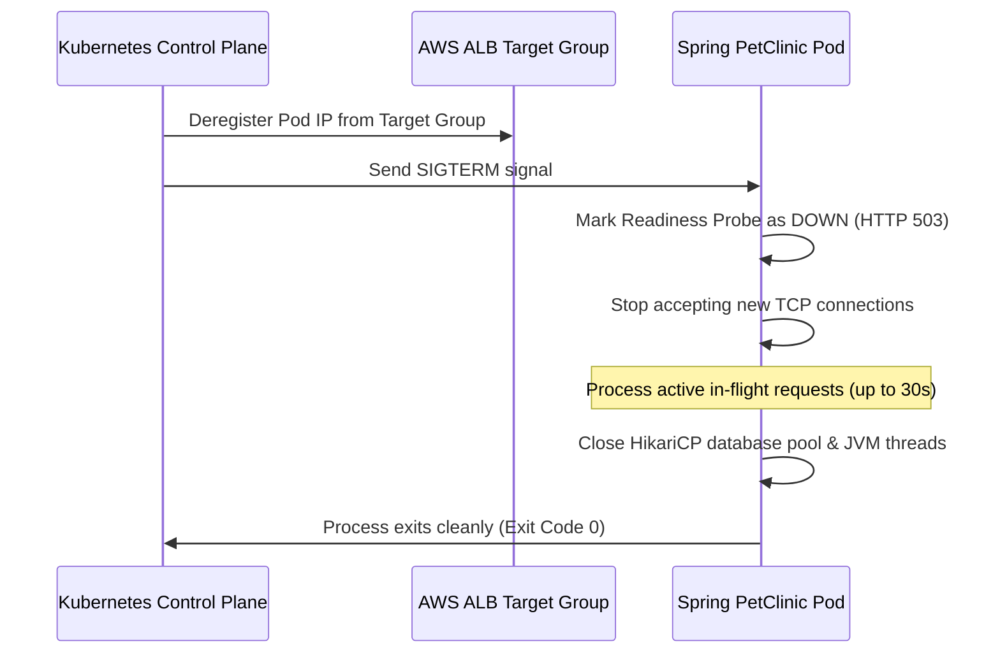

# Application Architecture & Runtime Configuration

This document covers the Spring PetClinic application, its Docker container configuration, JVM memory settings, database profiles, and health checks.

---

## 1. Application Overview

Spring PetClinic uses the following stack:
- **Framework**: Spring Boot 3.3.x
- **Language**: Java 17 (Eclipse Temurin OpenJDK runtime)
- **Database Access**: Spring Data JPA and Hibernate with HikariCP connection pooling
- **UI**: Thymeleaf server-side templates
- **Metrics**: Spring Boot Actuator with Micrometer Prometheus registry

```
                                  [ Incoming HTTP Traffic (Port 8080) ]
                                                    │
                                     [ Spring MVC DispatcherServlet ]
                                                    │
                      ┌─────────────────────────────┼─────────────────────────────┐
                      ▼                             ▼                             ▼
             [ OwnerController ]           [ PetController ]             [ VisitController ]
                      │                             │                             │
          (OwnerCreationCounter)           (PetCreationCounter)         (VisitCreationCounter)
                      │                             │                             │
                      └─────────────────────────────┼─────────────────────────────┘
                                                    ▼
                                       [ Spring Data JPA Repositories ]
                                                    │
                                       [ HikariCP Connection Pool ]
                                                    │
                               ┌────────────────────┴────────────────────┐
                               ▼                                         ▼
                   [ H2 In-Memory Database ]                [ MySQL Cloud Database ]
                   (Local Dev & Unit Tests)                 (Dev / Test / Prod Environments)
```

---

## 2. Hardened Container Image Architecture

The container image is built using a secure, minimal multi-stage pattern based on Alpine Linux.

### 2.1 Dockerfile Specification (`application/Dockerfile`)
```dockerfile
FROM eclipse-temurin:17-jre-alpine

# Upgrade OS packages to get latest security patches and install curl for healthchecks
RUN apk update --no-cache && \
    apk upgrade --no-cache && \
    apk add --no-cache curl tzdata expat && \
    addgroup -S appgroup -g 1001 && \
    adduser -S appuser -u 1001 -G appgroup

WORKDIR /app

# Copy compiled artifact from CI builder
ARG JAR_FILE=target/*.jar
COPY --chown=appuser:appgroup ${JAR_FILE} app.jar

# Enforce non-root execution
USER appuser:appgroup
EXPOSE 8080

# JVM container ergonomics for Kubernetes cgroup limits
ENV JAVA_TOOL_OPTIONS="-XX:+UseContainerSupport -XX:MaxRAMPercentage=75.0 -XX:InitialRAMPercentage=50.0 -Djava.security.egd=file:/dev/./urandom"

# Container runtime healthcheck
HEALTHCHECK --interval=30s --timeout=3s --start-period=40s --retries=3 \
  CMD curl -f http://localhost:8080/actuator/health || exit 1

ENTRYPOINT ["java", "-jar", "app.jar"]
```

### 2.2 Security & Operational Controls
1. **Minimal Base Image**: `eclipse-temurin:17-jre-alpine` reduces the attack surface to under 180MB, excluding compiler toolchains, package managers, and unnecessary OS utilities.
2. **Strict Non-Root User**: Runs as `appuser:appgroup` (UID 1001, GID 1001). The container has zero root capabilities inside the Linux kernel namespaces, mitigating container breakout risks.
3. **OS Vulnerability Patching**: `apk update && apk upgrade` executes at image build time to ensure patched libraries (e.g. `expat`, `openssl`, `busybox`) before artifacts are staged.

---

## 3. JVM Container Ergonomics & Memory Management

In containerized Kubernetes environments, standard Java memory calculations fail if the JVM attempts to read the host machine's total physical memory instead of the pod's cgroup memory boundary.

### 3.1 Memory Tuning Flags
The platform passes explicit runtime ergonomics via `JAVA_TOOL_OPTIONS`:

| JVM Flag | Technical Purpose |
| :--- | :--- |
| **`-XX:+UseContainerSupport`** | Enables the JVM to query Linux cgroup limits (`/sys/fs/cgroup/memory`) to detect container-allocated CPU and RAM. |
| **`-XX:MaxRAMPercentage=75.0`** | Allocates up to **75%** of the container's memory limit to the JVM heap. For a `1Gi` memory limit, maximum heap size is $\approx 768\text{MiB}$. |
| **`-XX:InitialRAMPercentage=50.0`** | Pre-allocates **50%** of the memory ceiling at startup ($\approx 512\text{MiB}$). Eliminates performance degradation caused by continuous early heap expansions. |
| **`-Djava.security.egd=file:/dev/./urandom`** | Prevents blocking on `/dev/random` during cryptographic entropy collection (such as SSL handshakes and session ID generation). |

### 3.2 Headroom Allocation
The remaining **25%** non-heap headroom is strictly reserved for:
- JVM Metaspace (class metadata).
- Thread stack allocations (`-Xss`, 1MB per thread).
- Native memory used by garbage collectors (G1GC) and JIT compiler buffers.
- Direct ByteBuffers and network I/O buffers.

*Failure to enforce the 75% limit results in the Linux kernel OOM Killer terminating the container with Exit Code 137.*

---

## 4. Persistence Layer & Multi-Profile Configuration

The application abstracts storage engines via Spring Profiles:



### 4.1 Development Profile (`h2`)
- Default active profile when no external database is configured.
- Embedded in-memory database initialized via [`application/src/main/resources/db/h2/schema.sql`](file:///home/devops/Atos/AtosGraduationProject/application/src/main/resources/db/h2/schema.sql) and `data.sql`.
- Fast, self-contained startup suitable for unit tests and local iteration.

### 4.2 Production Profile (`mysql`)
Configured in [`application/src/main/resources/application-mysql.yml`](file:///home/devops/Atos/AtosGraduationProject/application/src/main/resources/application-mysql.yml):
```yaml
spring:
  datasource:
    url: ${MYSQL_URL:jdbc:mysql://localhost:3306/petclinic}
    username: ${MYSQL_USER:root}
    password: ${MYSQL_PASS:root}
    driver-class-name: com.mysql.cj.jdbc.Driver
  jpa:
    database-platform: org.hibernate.dialect.MySQLDialect
    hibernate:
      ddl-auto: none
    open-in-view: false
    properties:
      hibernate:
        default_batch_fetch_size: 16
```

### 4.3 Production Database Best Practices
1. **Explicit DDL Management (`ddl-auto: none`)**: Prevents Hibernate from altering production tables dynamically at startup.
2. **Open Session in View Disabled (`open-in-view: false`)**: Closes database sessions immediately after repository transactions complete. Eliminates lazy-loading queries during web view rendering and prevents database connection pool exhaustion.
3. **Batch Fetching (`default_batch_fetch_size: 16`)**: Resolves the classic ORM $N+1$ query problem by fetching related associations in batches.

---

## 5. Zero-Downtime Graceful Shutdown Handshake

When Kubernetes replaces an application pod (during a Canary rollout, HPA scale-down, or Karpenter node consolidation), in-flight user requests must not be dropped.

### 5.1 Shutdown Sequence
Configured in [`application/src/main/resources/application.yml`](file:///home/devops/Atos/AtosGraduationProject/application/src/main/resources/application.yml):
```yaml
server:
  shutdown: graceful
spring:
  lifecycle:
    timeout-per-shutdown-phase: 30s
```



The 30-second graceful shutdown timeout matches Kubernetes `terminationGracePeriodSeconds: 30` in the pod spec, ensuring clean transaction completion without abrupt TCP resets.

---

## 6. Custom Metric Instrumentation & Controller Hooks

Domain metrics are directly instrumented within Spring MVC controllers using Micrometer `Counter` registries.

### 6.1 Controller Instrumentation
1. **`OwnerController.java`**:
   Tracks customer registrations via `petclinic.owners.created.total`.
2. **`PetController.java`**:
   Tracks pet additions via `petclinic.pets.created.total`.
3. **`VisitController.java`**:
   Tracks appointment reservations via `petclinic.visits.created.total`.

### 6.2 Testing Patterns
Controller web slice unit tests use Mockito mocks to prevent missing bean initialization errors:
```java
@WebMvcTest(OwnerController.class)
class OwnerControllerTests {
    @MockitoBean
    private OwnerRepository owners;

    @MockitoBean
    private Counter ownerCreationCounter;
    ...
}
```
This guarantees that automated CI test phases validate HTTP mappings and business validations without requiring a live Prometheus server during unit testing.
