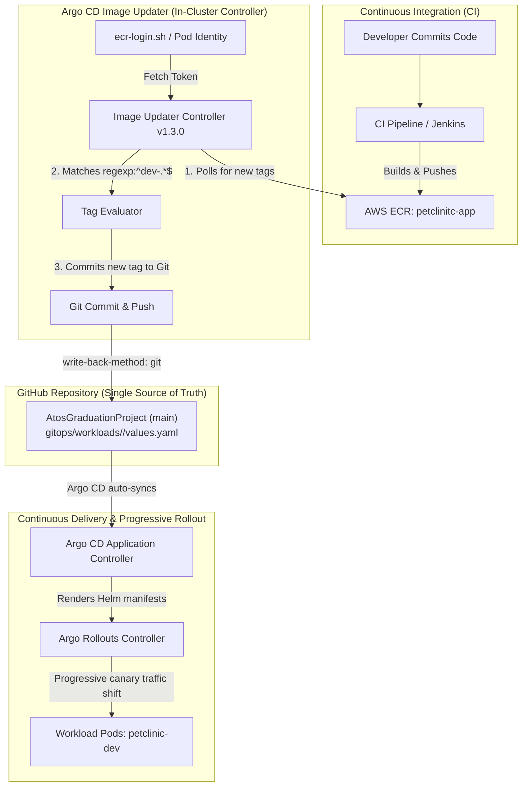

# Argo CD Image Updater: Architecture, Workflow & Operations Guide

## 1. Executive Summary & Purpose

In a modern **GitOps** pipeline, the Git repository is the **single source of truth** for all cluster state. However, a common dilemma arises during Continuous Integration (CI):
> *When a new container image is built and pushed to a registry (e.g., AWS ECR), how does the Git repository get updated without compromising security or cluttering CI runners with Git write credentials and cluster access?*

**Argo CD Image Updater** bridges this gap by decoupling CI from GitOps:
- CI pipelines (Jenkins / GitHub Actions) only need permission to push built images to AWS ECR.
- Image Updater runs **inside the cluster**, continuously tracks container registries, detects newly built tags matching your environment constraints, and **automatically writes updates back to Git** via standard commits.
- Argo CD detects the Git commit and immediately synchronizes the new image to Kubernetes or hands over to **Argo Rollouts** for zero-downtime canary deployment.

---

## 2. End-to-End Architecture & Workflow



### Detailed Workflow Stages:

1. **Build & Push**: CI builds the application container and pushes a tagged image (e.g., `dev-cac4070`) to AWS ECR.
2. **Registry Discovery**: Image Updater regularly polls AWS ECR using an IAM Pod Identity token acquired via `aws ecr get-login-password`.
3. **Constraint Evaluation**: Image Updater parses the list of tags against the strategy (`newest-build`) and regex pattern (`regexp:^dev-.*$`).
4. **Git Write-Back**: Image Updater checks out `origin/main`, updates the `image.tag` key in `gitops/workloads/<env>/values.yaml`, commits the change under author `argocd-image-updater`, and pushes to GitHub.
5. **GitOps Sync & Delivery**: Argo CD detects the commit on GitHub, updates the target deployment/rollout, and initiates rollout in Kubernetes.

---

## 3. Required Components & Configuration

### A. ECR Registry Authentication (`application.yaml`)

Because Image Updater runs inside EKS, it leverages **EKS Pod Identity** or **IRSA** attached to its ServiceAccount (`argocd-image-updater`). Because ECR requires Docker Basic Auth, an external authentication script is mounted inside the container to provide fresh authorization tokens.

File: `gitops/platform/image-updater/application.yaml`

```yaml
apiVersion: argoproj.io/v1alpha1
kind: Application
metadata:
  name: argocd-image-updater
  namespace: argocd
  annotations:
    argocd.argoproj.io/sync-wave: "1"
  finalizers:
    - resources-finalizer.argocd.argoproj.io
spec:
  project: platform-project
  source:
    repoURL: https://argoproj.github.io/argo-helm
    chart: argocd-image-updater
    targetRevision: 1.3.1 # Uses modern Controller and ImageUpdater CRD
    helm:
      values: |
        config:
          registries:
            - name: ECR
              api_url: https://069089526123.dkr.ecr.us-east-1.amazonaws.com
              prefix: 069089526123.dkr.ecr.us-east-1.amazonaws.com
              ping: yes
              credentials: ext:/scripts/ecr-login.sh
              credsexpire: 10h
        authScripts:
          enabled: true
          scripts:
            ecr-login.sh: |
              #!/bin/sh
              set -e
              TOKEN=$(aws ecr get-login-password --region us-east-1)
              echo "AWS:$TOKEN"
        serviceAccount:
          create: true
          name: argocd-image-updater
  destination:
    server: https://kubernetes.default.svc
    namespace: argocd
  syncPolicy:
    automated:
      prune: true
      selfHeal: true
```

---

### B. Git Write Credentials Secret

Image Updater uses Argo CD's repository secret store to push commits back to GitHub. The Kubernetes Secret must exist in the `argocd` namespace with the label `argocd.argoproj.io/secret-type: repository`.

```yaml
apiVersion: v1
kind: Secret
metadata:
  name: repo-atosgraduationproject
  namespace: argocd
  labels:
    argocd.argoproj.io/secret-type: repository
stringData:
  type: git
  url: https://github.com/Abdelhamid108/AtosGraduationProject.git
  username: Abdelhamid108
  password: <GITHUB_PERSONAL_ACCESS_TOKEN_WITH_REPO_WRITE>
```

> [!NOTE]
> Ensure the GitHub Personal Access Token (PAT) has the `repo` scope to allow pushing commits directly to the default branch.

---

### C. Declarative `ImageUpdater` Custom Resource (`image-updater-cr.yaml`)

Rather than relying on fragile application annotations, version 1.3.x introduces the `ImageUpdater` Kubernetes Custom Resource (`argocd-image-updater.argoproj.io/v1alpha1`). This resource declaratively specifies which environments to track, which tags to allow, and where to write changes.

File: `gitops/platform/image-updater/image-updater-cr.yaml`

```yaml
apiVersion: argocd-image-updater.argoproj.io/v1alpha1
kind: ImageUpdater
metadata:
  name: petclinic-image-updater
  namespace: argocd
spec:
  writeBackConfig:
    method: git
    gitConfig:
      branch: main

  applicationRefs:
    # -------------------------------------------------------------
    # Development Environment
    # -------------------------------------------------------------
    - namePattern: petclinic-dev
      writeBackConfig:
        method: git
        gitConfig:
          branch: main
          writeBackTarget: "helmvalues:../../gitops/workloads/dev/values.yaml"
      images:
        - alias: petclinic
          imageName: 069089526123.dkr.ecr.us-east-1.amazonaws.com/petclinic-project/petclinitc-app:1.0.0
          commonUpdateSettings:
            updateStrategy: newest-build
            allowTags: "regexp:^dev-.*$"
            forceUpdate: true
          manifestTargets:
            helm:
              name: image.repository
              tag: image.tag

    # -------------------------------------------------------------
    # Testing Environment
    # -------------------------------------------------------------
    - namePattern: petclinic-test
      writeBackConfig:
        method: git
        gitConfig:
          branch: main
          writeBackTarget: "helmvalues:../../gitops/workloads/test/values.yaml"
      images:
        - alias: petclinic
          imageName: 069089526123.dkr.ecr.us-east-1.amazonaws.com/petclinic-project/petclinitc-app:1.0.0
          commonUpdateSettings:
            updateStrategy: newest-build
            allowTags: "regexp:^test-.*$"
            forceUpdate: true
          manifestTargets:
            helm:
              name: image.repository
              tag: image.tag

    # -------------------------------------------------------------
    # Production Environment
    # -------------------------------------------------------------
    - namePattern: petclinic-prod
      writeBackConfig:
        method: git
        gitConfig:
          branch: main
          writeBackTarget: "helmvalues:../../gitops/workloads/prod/values.yaml"
      images:
        - alias: petclinic
          imageName: 069089526123.dkr.ecr.us-east-1.amazonaws.com/petclinic-project/petclinitc-app:1.0.0
          commonUpdateSettings:
            updateStrategy: newest-build
            allowTags: "regexp:^prod-.*$"
            forceUpdate: true
          manifestTargets:
            helm:
              name: image.repository
              tag: image.tag
```

---

## 4. Key Configuration Parameters Explained

| Field | Purpose | Example |
| :--- | :--- | :--- |
| `namePattern` | Glob or exact name of the Argo CD `Application` to monitor | `petclinic-dev` |
| `writeBackConfig.method` | Mechanism used to save the update. Always set to `git` for pure GitOps | `git` |
| `gitConfig.branch` | Git branch to write commits to | `main` |
| `gitConfig.writeBackTarget` | Path to the values file. **Must be relative to the Helm chart directory** | `helmvalues:../../gitops/workloads/dev/values.yaml` |
| `imageName` | Full ECR repository URL and base reference | `069089526123.../petclinitc-app:1.0.0` |
| `updateStrategy` | How candidate tags are sorted. `newest-build` selects the most recent image creation timestamp | `newest-build` |
| `allowTags` | Regex pattern matching environment-specific tag conventions. Requires `regexp:` prefix | `regexp:^dev-.*$` |
| `forceUpdate` | When `true`, forces update even if Argo CD application summary metadata is not populated | `true` |
| `manifestTargets.helm` | Dot-separated keys inside `values.yaml` to update | `name: image.repository`, `tag: image.tag` |

---

## 5. Pairing with Argo Rollouts (Progressive Delivery)

When Image Updater writes `dev-cac4070` to `values.yaml`, Argo CD updates the Kubernetes workload. When paired with **Argo Rollouts**, this triggers progressive delivery rather than an immediate rolling restart:

1. **Traffic Split**: Argo Rollouts routes a canary slice (e.g., 20%) to the new container.
2. **Automated Analysis**: Prometheus / CloudWatch metrics verify latency and error rates.
3. **Promotion or Rollback**:
   - If error rate is `< 1%`: Rollout promotes to 100%.
   - If error rate spikes: Rollout aborts and reverts traffic to the previous stable replica set without human intervention.

---

## 6. Operational Runbook & Troubleshooting

### How to test tag detection manually inside the cluster

To verify what tags Image Updater sees from AWS ECR without waiting for the sync interval:

```bash
kubectl exec -n argocd deploy/argocd-image-updater-controller -- \
  /manager test 069089526123.dkr.ecr.us-east-1.amazonaws.com/petclinic-project/petclinitc-app \
  --registries-conf-path /app/config/registries.conf \
  --update-strategy newest-build \
  --allow-tags "regexp:^dev-.*$" \
  --loglevel debug
```

Expected output:
```text
Found 6 tags in registry
latest image according to constraint is ...:dev-cac4070
```

---

### How to check controller logs

```bash
kubectl logs -n argocd deploy/argocd-image-updater-controller -f --tail=50
```

Look for confirmation of successful Git commits:
```text
Committing 1 parameter update(s) for application petclinic-dev
git fetch origin main
git checkout --force main
Successfully updated the live application spec
```

---

### Common Pitfalls & How They Were Solved

1. **`no tags found in registry` / `no basic auth credentials`**:
   - *Cause*: The container lacks Docker auth for ECR.
   - *Fix*: Verify `authScripts.ecr-login.sh` is enabled and ServiceAccount has `ecr:GetAuthorizationToken` via Pod Identity.
2. **`Invalid match option syntax`**:
   - *Cause*: Specifying `^dev-.*$` without the `regexp:` prefix.
   - *Fix*: Always prefix regex filters with `regexp:` (e.g., `regexp:^dev-.*$`).
3. **Commit written to wrong folder**:
   - *Cause*: `writeBackTarget: helmvalues:gitops/workloads/dev/values.yaml` evaluates relative to `helm/petclinic`.
   - *Fix*: Use `helmvalues:../../gitops/workloads/dev/values.yaml` to step back to repository root.
4. **Image skipped because "not live in application"**:
   - *Cause*: Legacy v0.17 relies on Argo CD `.status.summary.images`, which is empty for external Helm value files.
   - *Fix*: Use Chart `1.3.1` with the `ImageUpdater` CRD and `forceUpdate: true`.
