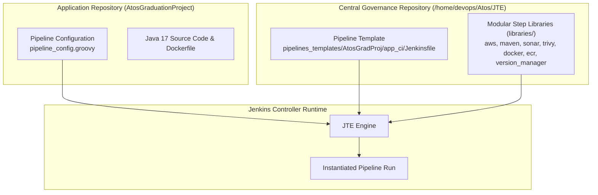
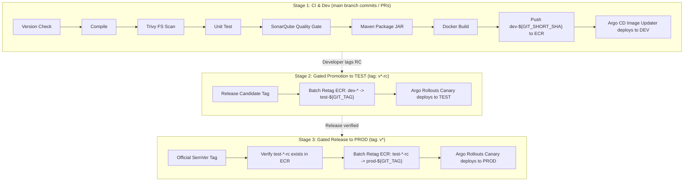

# CI/CD Pipeline Governance & Security Gates

This document covers the Jenkins CI/CD pipeline using the Jenkins Templating Engine (JTE). It details the pipeline configuration, step libraries, security scans, quality gates, and image promotion workflow.

---

## 1. Jenkins Templating Engine (JTE) Overview

Maintaining long, duplicated `Jenkinsfile` scripts across multiple repositories leads to configuration drift and maintenance overhead. The pipeline uses the **Jenkins Templating Engine (JTE)** to separate the workflow template from application source code:



### 1.1 Separation of Concerns
1. **Pipeline Templates (`pipelines_templates/`)**: Defines the high-level stage progression, execution triggers (`when` directives), and failure handling policies. Application developers cannot modify or delete stages.
2. **Step Libraries (`libraries/`)**: Reusable Groovy steps implementing standardized interfaces (`compileApp()`, `test()`, `scan()`, `buildImage()`, `push()`, `retagImage()`). Step implementations are updated globally without touching downstream application repositories.
3. **Application Pipeline Configuration (`pipeline_config.groovy`)**: Declares application-specific parameters (such as container registry URLs, S3 registry paths, and tool thresholds).

---

## 2. JTE Library Catalog & Technical Specifications

Located in [`/home/devops/Atos/JTE/libraries/`](file:///home/devops/Atos/JTE/libraries/):

| Library Name | Primary Functions | Key Parameters & Environment Bindings |
| :--- | :--- | :--- |
| **`aws`** | Manages ephemeral AWS STS authentication and role assumption. | `aws_credentials_id`, `aws_role_arn`, `aws_region`, `role_session_name: "PetClinicAppSession"` |
| **`version_manager`**| Queries S3 JSON registry to enforce semver sequence and prevent tag reuse. | `registry_path: "s3://.../version-registry.json"`, `strict_promotion: true`, `coverage_threshold: 80` |
| **`maven`** | Orchestrates clean compilation, unit testing, and JAR packaging. | `app_dir: "application"`, `maven_command: "./mvnw"` |
| **`sonar`** | Executes SonarQube static analysis and awaits quality gate webhooks. | `sonar_project: "petclinic"`, `sonar_host_url: "http://localhost:9000"`, `enforce_quality_gate: true` |
| **`trivy`** | Scans local filesystem dependencies and container images for CVEs. | `severity_threshold: "CRITICAL,HIGH"`, `exit_code: "1"`, `timeout: "20m"` |
| **`docker`** | Builds multi-stage container images using the local Docker engine. | `dockerfile_path: "application/Dockerfile"`, `registry_url`, `image_name` |
| **`ecr`** | Authenticates to Amazon ECR and executes API-level batch retagging. | `aws_region: "us-east-1"`, `ecr_registry`, `image_name` |

---

## 3. Pipeline Configuration (`pipeline_config.groovy`)

Located in [`/home/devops/Atos/JTE/pipelines_templates/AtosGradProj/app_ci/pipeline_config.groovy`](file:///home/devops/Atos/JTE/pipelines_templates/AtosGradProj/app_ci/pipeline_config.groovy):

```groovy
pipeline_template = 'app_ci/Jenkinsfile'

libraries {
    aws {
        aws_credentials_id = "petclinic-aws-credentials"
        aws_role_arn       = "arn:aws:iam::069089526123:role/JenkinsTerraformRole"
        aws_region         = "us-east-1"
        role_session_name  = "PetClinicAppSession"
        role_duration      = 3600
    }

    version_manager {
        app_dir            = "application"
        version_file       = "VERSION"
        registry_path      = "s3://petclinic-platform-version-registry-069089526123-us-east-1-an/version-registry.json"
        promotion_order    = ["dev", "test", "prod"]
        strict_promotion   = true
        component_name     = "petclinic"
        coverage_threshold = 80
    }

    maven {
        app_dir       = "application"
        maven_command = "./mvnw"
    }

    sonar {
        app_dir              = "application"
        maven_command        = "./mvnw"
        sonar_project        = "petclinic"
        sonar_credentials_id = "petclinic-sonar-cred"
        sonar_host_url       = "http://localhost:9000"
        enforce_quality_gate = true
    }

    docker {
        dockerfile_path   = "application/Dockerfile"
        build_context     = "application"
        registry_url      = "069089526123.dkr.ecr.us-east-1.amazonaws.com"
        image_name        = "petclinic-project/petclinitc-app"
        container_port    = 8080
        health_check_path = "/actuator/health"
    }

    trivy {
        severity_threshold = "CRITICAL,HIGH"
        exit_code          = "1"
        app_dir            = "application"
        timeout            = "20m"
    }
}
```

---

## 4. Pipeline Execution & Gated Promotion Lifecycle

The pipeline follows trunk-based development with tag-gated promotion. See [ADR-007: Trunk-Based Branching & Tag-Driven Promotion](decisions/adr-007-trunk-based-branching-and-tag-driven-promotion.md) for the design rationale.

Located in [`/home/devops/Atos/JTE/pipelines_templates/AtosGradProj/app_ci/Jenkinsfile`](file:///home/devops/Atos/JTE/pipelines_templates/AtosGradProj/app_ci/Jenkinsfile):



### 4.1 Strict Promotion & Immutable Artifacts
- **Zero Rebuild Anti-Pattern**: The container image is compiled and packaged **exactly once** during Stage 1. 
- **Batch Retagging via AWS ECR**: Promoting to `test` or `prod` executes an AWS ECR API call (`ecr.retagImage`) that attaches new tag pointers to the identical underlying image manifest digest.
- **Strict Verification**: The production release step fails immediately if the corresponding Release Candidate tag (`test-${env.GIT_TAG}-rc`) was never verified in the `test` environment.

---

## 5. Automated Security Gates & Quality Thresholds

### 5.1 SonarQube Quality Gate
- **Execution**: The pipeline runs `./mvnw sonar:sonar` and registers a webhook with the SonarQube server at `http://localhost:9000`.
- **Enforcement**: `waitForQualityGate()` pauses execution. The build fails if:
  - Code coverage on new code is $< 80\%$.
  - Any Blocker or Critical bugs are discovered.
  - Security rating drops below `A`.

### 5.2 Trivy Container & Filesystem Scanning
- **Vulnerability Scanner**: Trivy evaluates all third-party dependencies in `pom.xml` and the base container image.
- **Enforcement Parameters**:
  ```bash
  trivy fs --severity CRITICAL,HIGH --exit-code 1 application/
  ```
  If any CVE with severity `CRITICAL` or `HIGH` lacks an explicit whitelist exemption, Trivy exits with status code 1, immediately aborting the CI pipeline.

### 5.3 Distributed S3 Version Registry
- **Location**: `s3://petclinic-platform-version-registry-069089526123-us-east-1-an/version-registry.json`
- **Mechanism**: The `version_manager` step parses the JSON registry. If a proposed version tag already exists in the promotion history, the build halts to prevent overwriting existing release artifacts.

---

## 6. Terraform Infrastructure Pipeline Governance

Located in [`pipelines_templates/AtosGradProj/terraform/Jenkinsfile`](file:///home/devops/Atos/JTE/pipelines_templates/AtosGradProj/terraform/Jenkinsfile), this pipeline governs AWS infrastructure lifecycle actions with policy gates and artifact archiving:

### 6.1 Lifecycle Stage Differentiation (`ACTION = apply` vs `ACTION = destroy`)
- **`apply` Workflow**:
  1. `Terraform Init`: Reconfigures S3 state backend under `assumeRole`.
  2. `Lint & Validate`: Executes `terraform fmt -check` and `terraform validate`.
  3. `Security Policy Gate`: Runs Checkov SAST scan across `infra/` to detect security misconfigurations before planning.
  4. `Terraform Plan`: Generates a speculative plan binary (`tfplan-<BUILD_ID>.tfplan`), renders the plan diff text, and archives both as Jenkins artifacts.
  5. `Approval Guardrail`: Pauses for manual human review on branch `main`.
  6. `Execute`: Runs `deploy()` strictly against the stashed plan binary, exports outputs (`terraform output -json > terraform-output.json`), and archives `terraform-output.json` and `terraform-output.txt` as build artifacts.
- **`destroy` Fast-Path Workflow**:
  1. `Terraform Init`: Initializes backend and provider plugins.
  2. **Bypassed Stages**: `Lint & Validate`, `Security Policy Gate` (Checkov), and `Terraform Plan` are completely skipped to prevent unneeded scanning or plan mismatches.
  3. `Approval Guardrail`: Prompts for explicit human destruction confirmation (`Approve Terraform DESTROY Infrastructure ?`).
  4. `Execute`: Runs `destroy()` (`terraform destroy -auto-approve`) directly using credential `petclinic-tfvars`.

