# ADR-007: Trunk-Based Branching & Tag-Driven Promotion Strategy

## Context
A key operational decision in continuous delivery is how Git branches and tags map to environments (`dev`, `test`, `prod`) and deployment pipelines.

We evaluated different branching models to balance developer speed, release safety, and artifact immutability.

---

## Decision
We chose **Trunk-Based Development with Tag-Driven Promotion**.

- The `main` branch is the single source of truth.
- Developers work on short-lived feature branches and merge into `main` via Pull Requests.
- The `dev` environment continuously deploys the latest commits from `main`.
- The `test` and `prod` environments are gated exclusively by **Git tags** (`v*-rc` for Test, `v*.*.*` for Prod).
- The container image is built once on `main` and promoted across environments via AWS ECR tag updates without rebuilding.

---

## Options Considered

### Option 1: Environment Branching (`dev`, `test`, `main/prod` branches)
- Developers merge code from `feature` $\rightarrow$ `dev` branch $\rightarrow$ `test` branch $\rightarrow$ `prod` branch.
- **Why we rejected it**:
  - **Branch Drift**: Over time, `dev`, `test`, and `prod` branches diverge, causing merge conflicts during promotions.
  - **Rebuild Anti-Pattern**: CI pipelines often rebuild the Docker image on each branch merge, meaning the artifact deployed to production is not bit-for-bit identical to the artifact tested in staging.
  - **Hotfix Complexity**: Applying a hotfix requires cherry-picking across three branches in reverse order.

### Option 2: Classic GitFlow (`develop`, `release/*`, `hotfix/*`, `main`)
- Strict branching model with long-lived release and development branches.
- **Why we rejected it**:
  - Designed for scheduled, quarterly software releases with manual testing cycles.
  - Too slow and complex for containerized GitOps pipelines where multiple releases can happen weekly or daily.

### Option 3: Trunk-Based with Tag-Driven Promotion (Selected)
- All developers merge small, verified changes into `main`.
- CI builds image `petclinic:dev-${GIT_SHORT_SHA}` directly on `main` and deploys to `dev`.
- Promoting to `test` requires pushing a Release Candidate tag: `git tag v1.2.0-rc && git push origin v1.2.0-rc`.
- Promoting to `prod` requires pushing an official SemVer tag: `git tag v1.2.0 && git push origin v1.2.0`.
- The pipeline verifies the preceding candidate image exists in ECR and applies new tag pointers (`test-v1.2.0-rc`, `prod-v1.2.0`) directly via the ECR API without recompiling Java code or rebuilding the Docker image.

---

## Comparison Matrix

| Criteria | Environment Branches (`dev`/`test`/`prod`) | Classic GitFlow | Trunk-Based + Tag Gating (Selected) |
| :--- | :--- | :--- | :--- |
| **Source of Truth** | Multiple divergent branches. | `develop` and `main` branches. | **Single source of truth (`main`)**. |
| **Artifact Immutability** | Poor. Rebuilds images per branch. | Poor. Rebuilds on `release` merges. | **Guaranteed. Built once, retagged in ECR.** |
| **Merge Conflict Risk** | High. Constant sync merges needed. | Moderate. Release branch merges. | **Low. Short-lived feature branches only.** |
| **Auditability** | Low. Hard to know what commit is in Test. | Moderate. | **High. Git tags point to exact commits.** |
| **Promotion Mechanism**| Merge commit between branches. | Merge commit to `main`. | **Lightweight Git tag (`v*-rc`, `v*`).** |

---

## The Exact Promotion Flow

```mermaid
flowchart TD
    subgraph FeatureWork ["1. Feature Development"]
        Dev[Feature Branch: feature/XYZ] --> PR[Pull Request against main]
        PR --> Review[Unit Tests & SonarQube Quality Gate]
        Review --> Merge[Squash & Merge into main]
    end

    subgraph DevDeploy ["2. Automated DEV Deployment"]
        Merge --> CIBuild[Jenkins app_ci pipeline triggers]
        CIBuild --> Package[Compile & Build Docker image dev-SHA]
        Package --> PushECR[Push image to ECR]
        PushECR --> ImageUpdater[Argo CD Image Updater detects dev-SHA]
        ImageUpdater --> DeployDev[Deploys to petclinic-dev namespace]
    end

    subgraph TestPromotion ["3. Gated TEST Promotion"]
        DeployDev -.->|Manual Verification in Dev| TagRC["Developer pushes tag: v1.2.0-rc"]
        TagRC --> PipelineRC[Jenkins app_ci detects v*-rc tag]
        PipelineRC --> ECRRetagTest["ECR batch retag: dev-SHA -> test-v1.2.0-rc"]
        ECRRetagTest --> UpdaterTest[Image Updater detects test-v1.2.0-rc]
        UpdaterTest --> CanaryTest[Argo Rollouts Canary deploys to petclinic-test]
    end

    subgraph ProdRelease ["4. Gated PROD Release"]
        CanaryTest -.->|Canary verification passes| TagProd["Developer pushes tag: v1.2.0"]
        TagProd --> PipelineProd[Jenkins app_ci detects v* tag]
        PipelineProd --> StrictCheck["Verify test-v1.2.0-rc exists in ECR"]
        StrictCheck --> ECRRetagProd["ECR batch retag: test-v1.2.0-rc -> prod-v1.2.0"]
        ECRRetagProd --> UpdaterProd[Image Updater detects prod-v1.2.0]
        UpdaterProd --> CanaryProd[Argo Rollouts 5-step Canary deploys to petclinic-prod]
    end
```



---

## Implementation Details

1. **Jenkinsfile Tag Directives**:
   Located in [`/home/devops/Atos/JTE/pipelines_templates/AtosGradProj/app_ci/Jenkinsfile`](file:///home/devops/Atos/JTE/pipelines_templates/AtosGradProj/app_ci/Jenkinsfile):
   - Stage 1 (Dev): `when { not { buildingTag() }; changeset "application/**" }`
   - Stage 2 (Test): `when { tag pattern: "v*-rc", comparator: "GLOB" }`
   - Stage 3 (Prod): `when { tag pattern: "v*", comparator: "GLOB"; not { tag pattern: "v*-rc*", comparator: "GLOB" } }`

2. **Strict Promotion Enforcement**:
   In Stage 3, the pipeline asserts that the Release Candidate image was published before allowing promotion:
   ```groovy
   assumeRole {
       login()
       retagImage(
           source_tag: "test-${env.GIT_TAG}-rc",
           target_tag: "prod-${env.GIT_TAG}"
       )
   }
   ```
   If someone tries to release directly to production without testing an RC first, the step fails immediately with an image-not-found error from AWS ECR.

3. **Version Registry Concurrency**:
   Configured in `pipeline_config.groovy`:
   - Checks `s3://petclinic-platform-version-registry-069089526123-us-east-1-an/version-registry.json`.
   - Prevents tag reuse or accidental regression to older version numbers.

---

## Consequences
- Developers must follow the tagging convention (`vX.Y.Z-rc` $\rightarrow$ `vX.Y.Z`).
- The `main` branch must always remain in a releasable state. Broken code cannot be pushed directly to `main` without passing PR checks.
