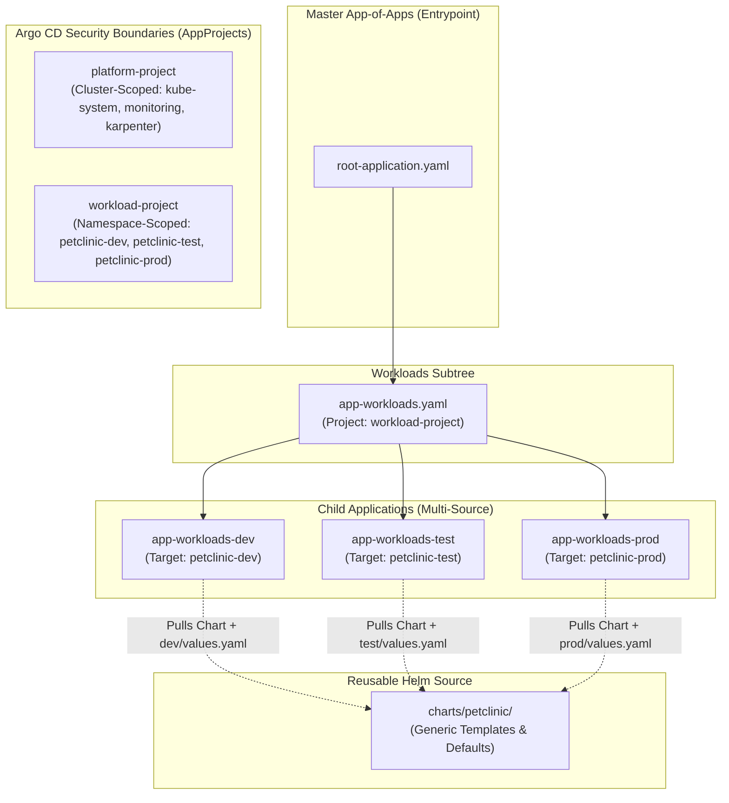

# GitOps Architecture & Implementation Specification

## 1. Executive Summary

This document details the **GitOps delivery architecture** implemented for the **Spring PetClinic** application on AWS EKS using **Argo CD**.

GitOps ensures that the entire desired state of the Kubernetes cluster—both platform infrastructure components and multi-environment application workloads—is declaratively stored in Git, version-controlled, auditable, and automatically synchronized.

---

## 2. GitOps Directory Structure (Current State)

```text
AtosGraduationProject/
│
├── gitops/                                   # GitOps Desired State & Argo CD Engine
│   ├── projects/                             # Argo CD RBAC & Project Security Boundaries
│   │   ├── platform-project.yaml             # AppProject for cluster-wide infrastructure & operators
│   │   └── workload-project.yaml             # AppProject for application namespaces (least-privilege)
│   │
│   ├── platform/                             # Platform Add-ons (Karpenter, Ingress, Monitoring, Secrets)
│   │
│   └── workloads/                            # Multi-Environment Application Workloads
│       ├── app-workloads.yaml                # Workloads Parent App-of-Apps (deploys dev, test, prod)
│       │
│       ├── dev/                              # Development Environment
│       │   ├── application.yaml              # Argo CD Child Application (Multi-Source)
│       │   └── values.yaml                   # Dev-specific Helm values
│       │
│       ├── test/                             # Testing Environment
│       │   ├── application.yaml              # Argo CD Child Application (Multi-Source)
│       │   └── values.yaml                   # Test-specific Helm values
│       │
│       └── prod/                             # Production Environment
│           ├── application.yaml              # Argo CD Child Application (Multi-Source)
│           └── values.yaml                   # Prod-specific Helm values (HPA, PDB, High Availability)
```

---

## 3. Argo CD App-of-Apps Architecture

The deployment follows the **Argo CD App-of-Apps pattern**, establishing a hierarchical parent-child relationship:



---

## 4. Security & Project Isolation Model

Two dedicated `AppProject` CRDs are established to enforce the **Principle of Least Privilege**:

### 4.1 `platform-project.yaml`
* **Purpose**: Manages cluster-level operators and controllers.
* **Target Namespaces**: `*` (including `kube-system`, `monitoring`, `karpenter`, `external-secrets`).
* **Cluster Resource Whitelist**: Allowed full cluster-level resource generation (`ClusterRole`, `ClusterRoleBinding`, `CustomResourceDefinition`, `NodePool`).

### 4.2 `workload-project.yaml`
* **Purpose**: Manages application workloads with strict namespace containment.
* **Target Namespaces**: `argocd`, `petclinic-dev`, `petclinic-test`, `petclinic-prod`.
* **Namespace Resource Whitelist**: Full control within assigned namespaces.
* **Cluster Resource Blacklist**: Workloads are strictly forbidden from creating cluster-wide administrative resources (`ClusterRole`, `ClusterRoleBinding`, `CustomResourceDefinition`, `Namespace`).

---

## 5. Argo CD Multi-Source Helm Pattern

Each environment (`dev`, `test`, `prod`) uses Argo CD's **Multi-Source Pattern**. This decouples the reusable chart logic from environment-specific configuration:

```yaml
spec:
  project: workload-project
  sources:
    # 1. Base Reusable Helm Chart
    - repoURL: 'https://github.com/Abdelhamid108/AtosGraduationProject.git'
      path: 'charts/petclinic'
      targetRevision: main
      helm:
        releaseName: petclinic-dev
        valueFiles:
          - $values/gitops/workloads/dev/values.yaml
    # 2. Environment Values Reference
    - repoURL: 'https://github.com/Abdelhamid108/AtosGraduationProject.git'
      targetRevision: main
      ref: values
```

### Benefits of this Pattern:
1. **DRY (Don't Repeat Yourself)**: A single chart definition in `charts/petclinic` serves all environments.
2. **Environment Parity**: Dev, test, and prod share identical template structures, differing only in parameter values (`values.yaml`).
3. **Automated Sync & Self-Healing**: All applications enable `selfHeal: true`, `prune: true`, and `CreateNamespace=true`.

---

## 6. Inventory of Implemented Files

| File Path | Resource Type | Description |
| :--- | :--- | :--- |
| `gitops/projects/platform-project.yaml` | `AppProject` | Security domain for platform controllers with cluster-wide privileges. |
| `gitops/projects/workload-project.yaml` | `AppProject` | Security domain for PetClinic application workloads with least-privilege restrictions. |
| `gitops/workloads/app-workloads.yaml` | `Application` | Parent App-of-Apps targeting `gitops/workloads` to automatically deploy all environments. |
| `gitops/workloads/dev/application.yaml` | `Application` | Multi-Source Argo CD application for `petclinic-dev`. |
| `gitops/workloads/dev/values.yaml` | `Helm Values` | Dev environment-specific values. |
| `gitops/workloads/test/application.yaml` | `Application` | Multi-Source Argo CD application for `petclinic-test`. |
| `gitops/workloads/test/values.yaml` | `Helm Values` | Test environment-specific values. |
| `gitops/workloads/prod/application.yaml` | `Application` | Multi-Source Argo CD application for `petclinic-prod`. |
| `gitops/workloads/prod/values.yaml` | `Helm Values` | Production environment-specific values (HPA, PDB, High Availability). |

---

## 7. Roadmap & Next Steps

1. **Reusable Helm Chart (`charts/petclinic/`)**:
   * Implement `Chart.yaml` and `values.yaml`.
   * Implement templates: `deployment.yaml`, `statefulset.yaml`, `service.yaml`, `service-headless.yaml`, `ingress.yaml` (AWS ALB), `externalsecret.yaml` (AWS SSM), `servicemonitor.yaml` (Prometheus), `hpa.yaml`, `pdb.yaml`, `networkpolicy.yaml`.
2. **Environment Values Customization**:
   * Populate `dev/values.yaml`, `test/values.yaml`, and `prod/values.yaml` with replicas, ingress hosts, resource limits, and probe timings.
3. **Platform Add-ons (`gitops/platform/`)**:
   * Implement Argo CD applications for AWS Load Balancer Controller, Karpenter, External Secrets Operator, and Prometheus Stack.
