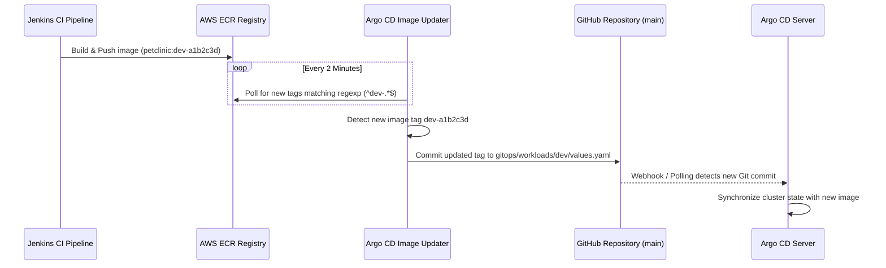

# GitOps & Progressive Delivery Architecture

This document covers the Argo CD GitOps setup, App-of-Apps structure, environment promotion, Argo CD Image Updater, and canary releases with Argo Rollouts.

---

## 1. GitOps Architecture & App-of-Apps Pattern

Argo CD continuously monitors this Git repository and synchronizes the cluster state to match. Direct manual edits made with `kubectl` are automatically detected and overwritten back to the Git state.

```mermaid
graph TD
    Root[Root Application Repository] --> PlatformApp[platform-app<br/>gitops/platform/application.yaml]
    Root --> WorkloadsApp[workloads-app<br/>gitops/workloads/application.yaml]

    subgraph PlatformLayer ["Platform Infrastructure (platform-project)"]
        PlatformApp --> ALB[aws-load-balancer-controller]
        PlatformApp --> Karp[karpenter & nodepools]
        PlatformApp --> Prom[kube-prometheus-stack]
        PlatformApp --> Dash[monitoring-dashboards]
        PlatformApp --> ESO[external-secrets]
        PlatformApp --> Upd[image-updater]
        PlatformApp --> Rol[argo-rollouts]
    end

    subgraph WorkloadsLayer ["Workload Applications (workloads-project)"]
        WorkloadsApp --> Dev[petclinic-dev (Wave 1)]
        WorkloadsApp --> Test[petclinic-test (Wave 2)]
        WorkloadsApp --> Prod[petclinic-prod (Wave 3)]
    end
```

### 1.1 Argo CD Project Governance
To isolate security boundaries, the cluster establishes two distinct `AppProject` definitions in [`gitops/projects/`](file:///home/devops/Atos/AtosGraduationProject/gitops/projects/):

1. **`platform-project.yaml`**:
   - Manages cluster-scoped CRDs, RBAC bindings, operators, and namespace provisioning.
   - Allowed destination namespaces: `kube-system`, `karpenter`, `argocd`, `monitoring`, `external-secrets`.
2. **`workloads-project.yaml`**:
   - Manages tenant applications strictly within authorized workload namespaces (`petclinic-dev`, `petclinic-test`, `petclinic-prod`).
   - Restricts permitted resource kinds via `namespaceResourceWhitelist` (Deployment, Rollout, Service, Ingress, HPA, PDB, ServiceMonitor, PrometheusRule). Cluster-level resources (e.g., ClusterRole, NodePool) are blocked.

### 1.2 Automated Self-Healing & Pruning
All applications enforce strict automated sync policies:
```yaml
syncPolicy:
  automated:
    prune: true
    selfHeal: true
  syncOptions:
    - CreateNamespace=true
    - SkipDryRunOnMissingResource=true
```
- **Self-Healing (`selfHeal: true`)**: If a pod or service is manually modified or deleted via `kubectl`, Argo CD detects the divergence and overwrites it back to the Git state within minutes.
- **Pruning (`prune: true`)**: When a resource manifest is removed from Git, Argo CD immediately deletes the corresponding Kubernetes object from the cluster.

---

## 2. Multi-Environment Promotion Strategy

The promotion model enforces progressive verification across three isolated environments:

| Environment | Target Namespace | Controller Type | Trigger Strategy | Gate / Verification |
| :--- | :--- | :--- | :--- | :--- |
| **Development (`dev`)** | `petclinic-dev` | Native `Deployment` | Automatic on `main` branch push (`dev-*` tags) | Automated unit tests & SonarQube quality gate |
| **Testing (`test`)** | `petclinic-test` | `Rollout` (Canary) | Gated on Release Candidate tag (`v*-rc`) | Automated Canary analysis & integration test suite |
| **Production (`prod`)** | `petclinic-prod` | `Rollout` (Canary) | Gated on official SemVer tag (`v*.*.*`) | 5-step canary rollout with real-time SLO verification |

---

## 3. Automated Image Updates (Argo CD Image Updater)

To eliminate the security anti-pattern of embedding Git write credentials inside Jenkins or granting Jenkins direct cluster access, **Argo CD Image Updater** operates as an in-cluster pull controller.

### 3.1 Architecture & Workflow


### 3.2 Declarative Configuration (`gitops/platform/image-updater/image-updater-cr.yaml`)

Image Updater is configured via a dedicated `ImageUpdater` custom resource managed by Argo CD:
```yaml
apiVersion: argocd-image-updater.argoproj.io/v1alpha1
kind: ImageUpdater
metadata:
  name: petclinic-image-updater
  namespace: argocd
spec:
  writeBackConfig:
    method: git
    gitConfig:
      branch: main
  applicationRefs:
    - namePattern: petclinic-dev
      writeBackConfig:
        method: git
        gitConfig:
          branch: main
          writeBackTarget: "helmvalues:../../gitops/workloads/dev/values.yaml"
      images:
        - alias: petclinic
          imageName: 069089526123.dkr.ecr.us-east-1.amazonaws.com/petclinic-project/petclinitc-app:1.0.0
          commonUpdateSettings:
            updateStrategy: newest-build
            allowTags: "regexp:^dev-.*$"
            forceUpdate: true
          manifestTargets:
            helm:
              name: image.repository
              tag: image.tag
```
- **Single ECR Repository**: All environments pull from the same ECR repository (`069089526123.dkr.ecr.us-east-1.amazonaws.com/petclinic-project/petclinitc-app`), differentiated strictly by tag prefixes (`dev-*`, `test-*`, `prod-*`).
- **ECR Authentication via Pod Identity**: The controller uses `atos-eks-cluster-image-updater-role` IAM role via **EKS Pod Identity** to generate dynamic ECR login tokens via `/scripts/ecr-login.sh`.
- **Git Write-Back Credentials via External Secrets Operator (ESO)**: Git credentials are not manually created. External Secrets Operator syncs `atos/petclinic/git-creds` from AWS Secrets Manager directly into the `repo-atosgraduationproject` secret in the `argocd` namespace, allowing Image Updater to commit and push tag updates to `main`.

---

## 4. Progressive Delivery & Automated Canary Analysis (Argo Rollouts)

In `test` and `prod`, updates are managed by the **Argo Rollouts** controller to achieve zero-downtime releases with automated regression protection.

### 4.1 Progressive Canary Steps (`helm/petclinic/templates/rollout.yaml`)
```yaml
strategy:
  canary:
    steps:
      - setWeight: 20
      - pause: { duration: 2m }
      - analysis:
          templates:
            - templateName: petclinic-success-rate
      - setWeight: 40
      - pause: { duration: 2m }
      - analysis:
          templates:
            - templateName: petclinic-success-rate
      - setWeight: 60
      - pause: { duration: 2m }
      - setWeight: 80
      - pause: { duration: 2m }
```

### 4.2 Background Metric Analysis (`helm/petclinic/templates/analysis-template.yaml`)
During the pauses between traffic increments, Argo Rollouts launches background `AnalysisRun` jobs executing real-time PromQL queries against Prometheus:

```yaml
apiVersion: argoproj.io/v1alpha1
kind: AnalysisTemplate
metadata:
  name: petclinic-success-rate
spec:
  metrics:
    - name: success-rate
      interval: 30s
      count: 3
      failureLimit: 1
      successCondition: result[0] >= 0.99
      provider:
        prometheus:
          address: http://prometheus-operated.monitoring.svc:9090
          query: |
            sum(rate(http_server_requests_seconds_count{status!~"5..", namespace="petclinic-prod"}[2m]))
            /
            sum(rate(http_server_requests_seconds_count{namespace="petclinic-prod"}[2m]))
```

### 4.3 Automated Rollback Mechanics
If the success rate drops below $99.0\%$ during any canary verification phase:
1. The `AnalysisRun` transitions to `Failed`.
2. The Rollout controller immediately aborts the deployment.
3. Traffic weight is instantly snapped from 20%/40% back to **100% on the stable ReplicaSet**.
4. The canary pods are terminated, protecting end users from sustained failures.
