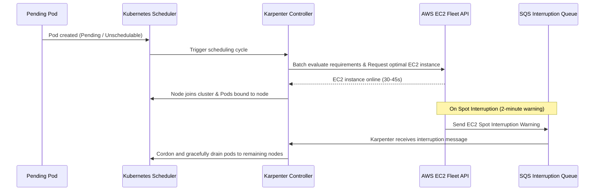

# Infrastructure & EKS Architecture

This document covers the cloud infrastructure for Spring PetClinic. It details the AWS VPC networking, EKS cluster configuration, access control, and Karpenter autoscaling in `us-east-1`.

---

## 1. VPC Network Architecture

The VPC spans three Availability Zones (`us-east-1a`, `us-east-1b`, `us-east-1c`) with separate public and private subnets:

```
                                  [ Internet ]
                                       │
                             [ Internet Gateway ]
                                       │
┌──────────────────────────────────────▼────────────────────────────────────────┐
│ AWS Virtual Private Cloud (VPC: 10.0.0.0/16)                                  │
│                                                                               │
│  [Public Subnets] (Tier 1 - Ingress & Egress)                                 │
│  ├── us-east-1a: 10.0.1.0/24 ── Bastion Host (t3.micro / SSM Session Manager)  │
│  ├── us-east-1b: 10.0.2.0/24 ── Internet-Facing Application Load Balancer    │
│  └── us-east-1c: 10.0.3.0/24 ── Single NAT Gateway (Elastic IP)               │
│                                       │                                       │
│ ─────────────────────────────────────┼─────────────────────────────────────── │
│                                       ▼                                       │
│  [Private Subnets] (Tier 2 - Compute & Data)                                  │
│  ├── us-east-1a: 10.0.10.0/24 ┐                                               │
│  ├── us-east-1b: 10.0.20.0/24 ┼── EKS Managed Nodes (t3.medium / AL2023)      │
│  └── us-east-1c: 10.0.30.0/24 ┘   Karpenter Dynamic Compute Capacity          │
│                                   Kubernetes Workload Pods (IP Target Group)  │
│                                   In-Cluster MySQL StatefulSet (EBS Volumes)  │
└───────────────────────────────────────────────────────────────────────────────┘
```

### 1.1 Subnet Allocation & CIDR Hierarchy
Defined in [`infra/modules/vpc/main.tf`](file:///home/devops/Atos/AtosGraduationProject/infra/modules/vpc/main.tf):

| Subnet CIDR | AZ | Type | Routing Target | AWS Tags / Discovery Purpose |
| :--- | :---: | :---: | :--- | :--- |
| `10.0.1.0/24` | `us-east-1a` | Public | Internet Gateway (`igw-...`) | `kubernetes.io/role/elb = 1`, Bastion Placement |
| `10.0.2.0/24` | `us-east-1b` | Public | Internet Gateway (`igw-...`) | `kubernetes.io/role/elb = 1`, ALB Listener Placement |
| `10.0.3.0/24` | `us-east-1c` | Public | Internet Gateway (`igw-...`) | `kubernetes.io/role/elb = 1`, NAT Gateway Placement |
| `10.0.10.0/24` | `us-east-1a` | Private | NAT Gateway (`nat-...`) | `kubernetes.io/role/internal-elb = 1`, `karpenter.sh/discovery = "atos-eks-cluster"` |
| `10.0.20.0/24` | `us-east-1b` | Private | NAT Gateway (`nat-...`) | `kubernetes.io/role/internal-elb = 1`, `karpenter.sh/discovery = "atos-eks-cluster"` |
| `10.0.30.0/24` | `us-east-1c` | Private | NAT Gateway (`nat-...`) | `kubernetes.io/role/internal-elb = 1`, `karpenter.sh/discovery = "atos-eks-cluster"` |

### 1.2 Subnet Tagging for Controller Auto-Discovery
AWS controllers discover network resources via standardized tag contracts:
- `kubernetes.io/role/elb = 1`: Instructs the AWS Load Balancer Controller to deploy internet-facing Application Load Balancers into these subnets.
- `kubernetes.io/role/internal-elb = 1`: Instructs the controller where internal load balancers or private endpoints can be provisioned.
- `karpenter.sh/discovery = "atos-eks-cluster"`: Used by Karpenter `EC2NodeClass` to discover target subnets across all 3 AZs for launching EC2 worker nodes.

### 1.3 Egress Architecture
Egress internet traffic from private subnets (e.g., container image pulls from public registries, outbound telemetry, OS package updates) is routed via a single NAT Gateway (`single_nat_gateway = true`). This architectural trade-off reduces AWS NAT Gateway hourly runtime charges while maintaining complete isolation from inbound unsolicited internet traffic.

---

## 2. Bastion Host

The Bastion host provides secure terminal access to the private EKS cluster.

### 2.1 Security Configuration
- **Port 22 SSH Disabled**: Security group `module.compute.bastion_sg` contains no inbound rules. Port 22 is closed.
- **Access Method**: Connects via AWS Systems Manager (SSM) Session Manager.
- **Instance Metadata Service (IMDSv2)**: Mandatory session tokens enforced on the EC2 instance:
  ```hcl
  metadata_options {
    http_endpoint               = "enabled"
    http_tokens                 = "required"
    http_put_response_hop_limit = 1
  }
  ```
- **IAM Role**: Uses instance profile `atos-eks-cluster-bastion-role` with policy `AmazonSSMManagedInstanceCore`.

### 2.2 Connecting to the Bastion
Connect via AWS CLI with the SSM Session Manager plugin:
```bash
aws ssm start-session --target $(aws ec2 describe-instances \
  --filters "Name=tag:Name,Values=atos-eks-cluster-bastion" "Name=instance-state-name,Values=running" \
  --query "Reservations[0].Instances[0].InstanceId" --output text)
```

---

## 3. Amazon EKS Cluster Configuration

The EKS cluster runs Kubernetes 1.31.

### 3.1 Control Plane Configuration
Defined in [`infra/modules/eks/main.tf`](file:///home/devops/Atos/AtosGraduationProject/infra/modules/eks/main.tf):
- **Private API Endpoint**:
  - `endpoint_private_access = true`: Control plane API is reachable from inside the VPC.
  - `endpoint_public_access = false`: Control plane API cannot be accessed from the public internet.
- **KMS Secret Encryption**:
  Kubernetes secrets are encrypted at rest using an AWS KMS customer-managed key:
  ```hcl
  encryption_config = {
    provider = { key_arn = module.kms.key_arn }
    resources = ["secrets"]
  }
  ```
- **Control Plane Logging**:
  Sends diagnostic logs to CloudWatch Log Group `/aws/eks/atos-eks-cluster/cluster`:
  - `api`: API server requests.
  - `audit`: User and service account activity.
  - `authenticator`: IAM authentication events.
  - `controllerManager`: Controller state transitions.
  - `scheduler`: Pod placement decisions.

### 3.2 Declarative EKS Access Entries (Modern RBAC)
The cluster utilizes the **AWS EKS Access Entries API** introduced in Kubernetes 1.28+, eliminating the legacy, brittle `aws-auth` ConfigMap:

```hcl
access_entries = {
  jenkins_terraform = {
    principal_arn = var.bastion_role_arn
    policy_associations = {
      admin = {
        policy_arn = "arn:aws:eks::aws:cluster-access-policy/AmazonEKSClusterAdminPolicy"
        access_scope = { type = "cluster" }
      }
    }
  }
}
```
Access entries are managed directly as native AWS cloud resources, avoiding race conditions during cluster bootstrap and preventing syntax corruption from breaking cluster administration.

---

## 4. EKS Pod Identity Architecture

Pods authenticate to AWS service APIs (ECR, SQS, Secrets Manager) using **EKS Pod Identity**.

### 4.1 Comparison with Legacy IRSA
```
Legacy IRSA (Brittle):
  Pod -> Projected Token -> OIDC Provider URL -> AWS STS -> IAM Role
  * Requires OIDC Provider per cluster.
  * Every IAM Role trust policy hardcodes cluster OIDC ID. Rebuilding cluster breaks all IAM roles.

EKS Pod Identity (Resilient):
  Pod -> eks-pod-identity-agent DaemonSet -> AWS STS (pods.eks.amazonaws.com) -> IAM Role
  * Static trust policy across all clusters. Rebuilding cluster requires zero IAM role mutations.
```

### 4.2 IAM Role Associations
Configured in [`infra/modules/eks/pod_identity.tf`](file:///home/devops/Atos/AtosGraduationProject/infra/modules/eks/pod_identity.tf):

| Application | Namespace | Service Account | Target IAM Role | Attached Policies |
| :--- | :--- | :--- | :--- | :--- |
| **AWS Load Balancer Controller** | `kube-system` | `aws-load-balancer-controller` | `atos-eks-cluster-alb-controller-role` | Ingress, ALB, TargetGroup permissions |
| **External Secrets Operator** | `external-secrets` | `external-secrets` | `atos-eks-cluster-external-secrets-role` | `secretsmanager:GetSecretValue`, `ssm:GetParameter` |
| **Argo CD Image Updater** | `argocd` | `argocd-image-updater` | `atos-eks-cluster-image-updater-role` | `ecr:DescribeImages`, `ecr:GetAuthorizationToken` |
| **EBS CSI Controller** | `kube-system` | `ebs-csi-controller-sa` | `atos-eks-cluster-ebs-csi-role` | `AmazonEBSCSIDriverPolicy` |

---

## 5. Karpenter Autoscaling & Spot Interruption Architecture

Karpenter (v1.14.1) handles dynamic compute provisioning, launching right-sized EC2 instances directly via AWS EC2 Fleet APIs without intermediate Auto Scaling Groups (ASGs).

### 5.1 Karpenter Architectural Model


### 5.2 Deterministic IAM Role Configuration
In `infra/modules/eks/karpenter.tf`, deterministic naming is enforced:
```hcl
node_iam_role_use_name_prefix = false
node_iam_role_name            = "Karpenter-${var.cluster_name}"
```
This guarantees that the node IAM role created in AWS is always named strictly `Karpenter-atos-eks-cluster`. It eliminates random hash regeneration across `terraform destroy` and `terraform apply` cycles, allowing `nodepool.yaml` to reference `role: "Karpenter-atos-eks-cluster"` without manual GitOps updates.

### 5.3 NodePool & EC2NodeClass Specification
Configured in [`gitops/platform/karpenter/nodepool.yaml`](file:///home/devops/Atos/AtosGraduationProject/gitops/platform/karpenter/nodepool.yaml):
- **NodePool**:
  - Architecture: `amd64`
  - Capacity Type: `on-demand`
  - Consolidation Policy: `WhenEmptyOrUnderutilized` (drains and terminates underutilized instances after 30 seconds).
- **EC2NodeClass**:
  - AMI Family: `AL2023` with alias `al2023@latest`.
  - IAM Role: `Karpenter-atos-eks-cluster`.
  - Subnet & Security Group Discovery: Queries tag `karpenter.sh/discovery = "atos-eks-cluster"`.

---

## 6. Terraform Remote State & Concurrency Control

Terraform state is stored remotely with cryptographic encryption and distributed concurrency control.

### 6.1 State Configuration (`infra/providers.tf`)
```hcl
backend "s3" {
  bucket       = "petclinic-app-tfstate-069089526123-us-east-1-an"
  key          = "petclinic-app/terraform.tfstate"
  region       = "us-east-1"
  encrypt      = true
  use_lockfile = true
}
```

### 6.2 Native S3 State Locking (`use_lockfile = true`)
The setup leverages modern native S3 state locking (available in Terraform 1.10+):
- Eliminates the requirement to provision, manage, and pay for an external AWS DynamoDB lock table.
- When an execution begins, Terraform places a temporary `.tflock` object in the target S3 path (`petclinic-app/terraform.tfstate.tflock`).
- The lock is atomically released upon execution completion.
- If a CI job crashes while holding the lock, release it cleanly via:
  ```bash
  terraform force-unlock <LOCK_ID>
  ```
