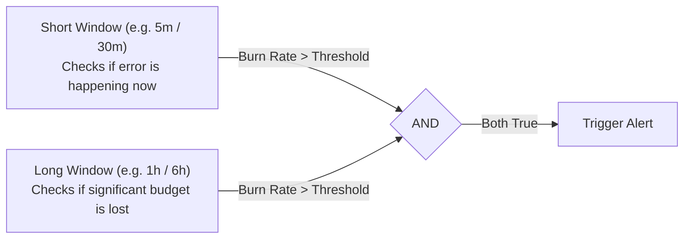

# SRE Observability & Error Budget Alerting

This document covers the monitoring, reliability targets, alerting rules, and Grafana dashboards for the Spring PetClinic application on Amazon EKS.

---

## 1. Service Level Objectives (SLOs) & Error Budget

Reliability is measured over a rolling **30-day window** (43,200 minutes).

### 1.1 Targets

| Metric | Target | Description | 30-Day Budget | Allowed Downtime |
| :--- | :---: | :--- | :--- | :--- |
| **Availability** | **99.9%** | Non-5xx HTTP responses / total valid HTTP requests | 0.1% failed requests | **43.2 minutes** |
| **Latency** | **95.0%** | Requests served in $\le 500\text{ms}$ | 5.0% slow requests | N/A |

### 1.2 Availability Calculation
The availability indicator measures successful responses over all valid requests:

$$\text{Availability} = \frac{\sum \text{Requests}_{\text{status} < 500} - \text{Requests}_{\text{status} \in \{400, 404\}}}{\sum \text{Total Requests} - \text{Requests}_{\text{status} \in \{400, 404\}}}$$

Client errors (HTTP 400 and 404) are excluded from both sides of the ratio so invalid client input does not consume the error budget.

### 1.3 Burn Rate Calculation
The **Burn Rate ($B$)** measures how fast the error budget is consumed compared to the allowable rate over 30 days. At $B = 1.0$, the budget lasts exactly 30 days:

$$\text{Burn Rate } B = \frac{\text{Observed Error Rate}}{1 - \text{SLO}} = \frac{\text{Observed Error Rate}}{0.001}$$

$$\text{Time to Exhaust Budget} = \frac{30\text{ days}}{B}$$

For example:
- At a **14.4x burn rate**, 2% of the monthly budget is consumed in 1 hour (100% consumed in ~50 hours).
- At a **6x burn rate**, 5% of the monthly budget is consumed in 6 hours (100% consumed in 5 days).

---

## 2. Multi-Window Multi-Burn-Rate Alerting

A simple threshold alert (like "error rate > 1% for 5m") either fires on short transient blips or misses slow leaks that drain the budget over several days.

To solve this, alerting rules use **paired short and long time windows** based on Google's SRE guidelines. An alert only fires when both windows cross the burn rate threshold at the same time.



### 2.1 Alert Rules Matrix

| Alert Name | Severity | Long Window | Short Window | Burn Rate | Budget Used | Action |
| :--- | :---: | :---: | :---: | :---: | :---: | :--- |
| **`PetClinicAvailabilityFastBurn`** | `critical` | 1 hour | 5 minutes | **14.4x** | 2% in 1 hour | Page on-call immediately |
| **`PetClinicAvailabilitySlowBurn`** | `warning` | 6 hours | 30 minutes | **6.0x** | 5% in 6 hours | Send ticket / Slack message |
| **`PetClinicHighHttpLatency`** | `warning` | 5 minutes | — | P95 > 500ms | — | Check CPU or DB load |
| **`PetClinicServiceDown`** | `critical` | 1 minute | — | `up == 0` | 100% Outage | Page on-call immediately |
| **`PetClinicHikariCPPoolStarvation`**| `critical` | 2 minutes | — | `pending > 0` | DB Exhaustion | Page on-call immediately |

---

## 3. Prometheus Rule Specifications (`PrometheusRule`)

Recording rules precompute resource-intensive aggregations to keep Grafana queries fast and prevent Alertmanager timeouts.

### 3.1 Recording Rules Architecture
Located in [`helm/petclinic/templates/prometheus-rules.yaml`](file:///home/devops/Atos/AtosGraduationProject/helm/petclinic/templates/prometheus-rules.yaml):

```yaml
apiVersion: monitoring.coreos.com/v1
kind: PrometheusRule
metadata:
  name: petclinic-recording-rules
  labels:
    release: prometheus
spec:
  groups:
    - name: petclinic.slo-recording-rules
      interval: 30s
      rules:
        # Base Request Rate (1 hour)
        - record: service:http_requests:rate1h
          expr: sum by (namespace) (rate(http_server_requests_seconds_count{status!~"404|400", namespace=~"petclinic-.*"}[1h]))

        # Base Error Rate (1 hour)
        - record: service:http_errors:rate1h
          expr: sum by (namespace) (rate(http_server_requests_seconds_count{status=~"5..", namespace=~"petclinic-.*"}[1h]))

        # Short Window Burn Rates
        - record: service:http_availability:burn_rate5m
          expr: |
            (sum by (namespace) (rate(http_server_requests_seconds_count{status=~"5..", namespace=~"petclinic-.*"}[5m]))
             /
             sum by (namespace) (rate(http_server_requests_seconds_count{status!~"404|400", namespace=~"petclinic-.*"}[5m])))
            / 0.001

        - record: service:http_availability:burn_rate30m
          expr: |
            (sum by (namespace) (rate(http_server_requests_seconds_count{status=~"5..", namespace=~"petclinic-.*"}[30m]))
             /
             sum by (namespace) (rate(http_server_requests_seconds_count{status!~"404|400", namespace=~"petclinic-.*"}[30m])))
            / 0.001

        # Long Window Burn Rates
        - record: service:http_availability:burn_rate1h
          expr: (service:http_errors:rate1h / service:http_requests:rate1h) / 0.001

        - record: service:http_availability:burn_rate6h
          expr: |
            (sum by (namespace) (rate(http_server_requests_seconds_count{status=~"5..", namespace=~"petclinic-.*"}[6h]))
             /
             sum by (namespace) (rate(http_server_requests_seconds_count{status!~"404|400", namespace=~"petclinic-.*"}[6h])))
            / 0.001

        # Rolling 30-Day SLA Compliance Percentage
        - record: service:http_sla_compliance:ratio30d
          expr: |
            1 - (
              sum by (namespace) (increase(http_server_requests_seconds_count{status=~"5..", namespace=~"petclinic-.*"}[30d]))
              /
              sum by (namespace) (increase(http_server_requests_seconds_count{status!~"404|400", namespace=~"petclinic-.*"}[30d]))
            )

        # Remaining Error Budget (%)
        - record: service:http_error_budget_remaining:percent
          expr: clamp_min(100 * (service:http_sla_compliance:ratio30d - 0.999) / 0.001, 0)
```

### 3.2 Alerting Rules Architecture
Located in [`helm/petclinic/templates/slo-alerts.yaml`](file:///home/devops/Atos/AtosGraduationProject/helm/petclinic/templates/slo-alerts.yaml):

```yaml
apiVersion: monitoring.coreos.com/v1
kind: PrometheusRule
metadata:
  name: petclinic-slo-alerts
  labels:
    release: prometheus
spec:
  groups:
    - name: petclinic.slo-alerts
      rules:
        # Critical Fast Burn (14.4x over 1h and 5m)
        - alert: PetClinicAvailabilityFastBurn
          expr: |
            service:http_availability:burn_rate5m{namespace="petclinic-prod"} > 14.4
            and on (namespace, service)
            service:http_availability:burn_rate1h{namespace="petclinic-prod"} > 14.4
          for: 2m
          labels:
            severity: critical
            slo: availability
          annotations:
            summary: "Critical 99.9% Error Budget Fast Burn"
            description: "High error rate (Burn Rate > 14.4x). 2% of the monthly error budget consumed in the last hour."

        # Warning Slow Burn (6.0x over 6h and 30m)
        - alert: PetClinicAvailabilitySlowBurn
          expr: |
            service:http_availability:burn_rate30m{namespace="petclinic-prod"} > 6.0
            and on (namespace, service)
            service:http_availability:burn_rate6h{namespace="petclinic-prod"} > 6.0
          for: 15m
          labels:
            severity: warning
            slo: availability
          annotations:
            summary: "Warning 99.9% Error Budget Slow Burn"
            description: "Sustained error rate (Burn Rate > 6.0x). 5% of monthly error budget consumed in 6 hours."
```

---

## 4. Application Metric Instrumentation (Micrometer)

The application uses Spring Boot Actuator with `micrometer-registry-prometheus` to export metrics on port 8080 at `/actuator/prometheus`.

### 4.1 Actuator Configuration (`application.yml`)
Located in [`application/src/main/resources/application.yml`](file:///home/devops/Atos/AtosGraduationProject/application/src/main/resources/application.yml):

```yaml
management:
  endpoints:
    web:
      exposure:
        include:
          - health
          - info
          - prometheus
          - metrics
          - threaddump
          - heapdump
  endpoint:
    health:
      show-details: always
      probes:
        enabled: true
  prometheus:
    metrics:
      export:
        enabled: true
  metrics:
    distribution:
      percentiles-histogram:
        http.server.requests: true
      percentiles:
        '[http.server.requests]': 0.50,0.90,0.95,0.99
      slo:
        '[http.server.requests]': 50ms,100ms,200ms,500ms,1s
    tags:
      application: petclinic
      environment: ${SPRING_PROFILES_ACTIVE:default}
    web:
      server:
        request:
          max-uri-tags: 100
```

### 4.2 Key Engineering Controls
1. **Histogram Generation (`percentiles-histogram: true`)**: Generates underlying histogram buckets so Prometheus can calculate arbitrary quantiles using `histogram_quantile()`.
2. **Fixed SLO Boundaries**: Generates buckets specifically at `50ms`, `100ms`, `200ms`, `500ms`, and `1s` to support latency SLO evaluations.
3. **Cardinality Protection (`max-uri-tags: 100`)**: Caps the maximum number of unique URI tag values to 100. This prevents memory leaks caused by malicious requests with randomized URL paths.
4. **Global Dimensional Tags**: Automatically tags every metric with `application="petclinic"` and `environment="<profile>"`.

### 4.3 Custom Business KPI Metric Instrumentation
Custom domain counters are injected into Spring MVC controllers:

```java
// OwnerController.java
@Controller
class OwnerController {
    private final Counter ownerCreationCounter;

    public OwnerController(OwnerRepository owners, MeterRegistry registry) {
        this.owners = owners;
        this.ownerCreationCounter = Counter.builder("petclinic.owners.created.total")
            .description("Total number of customer owners registered")
            .register(registry);
    }

    @PostMapping("/owners/new")
    public String processCreationForm(@Valid Owner owner, BindingResult result) {
        if (result.hasErrors()) { return VIEWS_OWNER_CREATE_OR_UPDATE_FORM; }
        this.owners.save(owner);
        this.ownerCreationCounter.increment();
        return "redirect:/owners/" + owner.getId();
    }
}
```

- `petclinic.owners.created.total`: Incremented whenever a new pet owner is created.
- `petclinic.pets.created.total`: Incremented whenever a new pet is registered.
- `petclinic.visits.created.total`: Incremented whenever an appointment visit is booked.

---

## 5. Prometheus Scrape Configuration (`ServiceMonitor`)

The Prometheus Operator scrapes pods using a declarative Custom Resource:

```yaml
apiVersion: monitoring.coreos.com/v1
kind: ServiceMonitor
metadata:
  name: petclinic-servicemonitor
  labels:
    release: prometheus
spec:
  selector:
    matchLabels:
      app.kubernetes.io/name: petclinic
  endpoints:
    - port: http
      path: /actuator/prometheus
      interval: 15s
      scrapeTimeout: 10s
```

The operator controller watches for `ServiceMonitor` objects matching label `release: prometheus`, dynamically generates the target configurations, and reloads Prometheus without process restarts.

---

## 6. Grafana Dashboards as Code

Dashboards are provisioned declaratively via GitOps as Kubernetes ConfigMaps in [`gitops/platform/monitoring-dashboards/`](file:///home/devops/Atos/AtosGraduationProject/gitops/platform/monitoring-dashboards/). The Grafana sidecar automatically detects these ConfigMaps and imports them into Grafana.

### 6.1 SLO & Error Budget Dashboard (`dashboard-petclinic-slo-error-budget.yaml`)
- **Current Availability Gauge**:
  ```promql
  service:http_sla_compliance:ratio30d{namespace="$namespace"} * 100
  ```
  Color thresholds: Green $\ge 99.9\%$, Yellow $99.8\% - 99.9\%$, Red $< 99.8\%$.
- **Remaining Error Budget Gauge**:
  ```promql
  service:http_error_budget_remaining:percent{namespace="$namespace"}
  ```
  Color thresholds: Green $\ge 50\%$, Yellow $20\% - 50\%$, Red $< 20\%$.
- **Error Budget Burn Rates (1h, 6h, 3d, 14d)**:
  Tracks multi-window consumption rates against the 14.4x and 6.0x alarm thresholds.

### 6.2 Golden Signals Dashboard (`dashboard-petclinic-golden-signals.yaml`)
1. **Traffic**:
   ```promql
   sum by (namespace) (rate(http_server_requests_seconds_count{namespace="$namespace"}[1m]))
   ```
2. **Errors (5xx & 4xx)**:
   ```promql
   sum by (status) (rate(http_server_requests_seconds_count{namespace="$namespace"}[1m]))
   ```
3. **Latency (P50, P95, P99)**:
   ```promql
   histogram_quantile(0.95, sum by (le) (rate(http_server_requests_seconds_bucket{namespace="$namespace"}[1m])))
   ```
4. **Saturation (JVM Heap & CPU)**:
   ```promql
   jvm_memory_used_bytes{area="heap", namespace="$namespace"} / jvm_memory_max_bytes{area="heap", namespace="$namespace"} * 100
   ```
5. **Database Connection Pool (HikariCP)**:
   ```promql
   hikaricp_connections_active{namespace="$namespace"}
   ```

---

## 7. Operational PromQL Queries

Use these queries in Prometheus or Grafana to investigate incidents:

| Question | PromQL Expression | Threshold / Normal Value |
| :--- | :--- | :--- |
| **Is the 99.9% SLO breaching?** | `service:http_sla_compliance:ratio30d * 100` | Below 99.9% |
| **How fast is the budget burning?** | `service:http_availability:burn_rate1h` | Critical if $> 14.4x$, Warning if $> 6x$ |
| **Which endpoints have HTTP 500 errors?** | `topk(5, sum by (uri) (rate(http_server_requests_seconds_count{status=~"5.."}[5m])))` | Higher rates indicate the failing routes |
| **Is the database connection pool full?** | `hikaricp_connections_pending > 0` | Should be 0. Positive values mean queries are waiting |
| **Are pods crashing from out-of-memory?** | `increase(kube_pod_container_status_restarts_total[1h])` | Greater than 0 indicates pod restarts |
