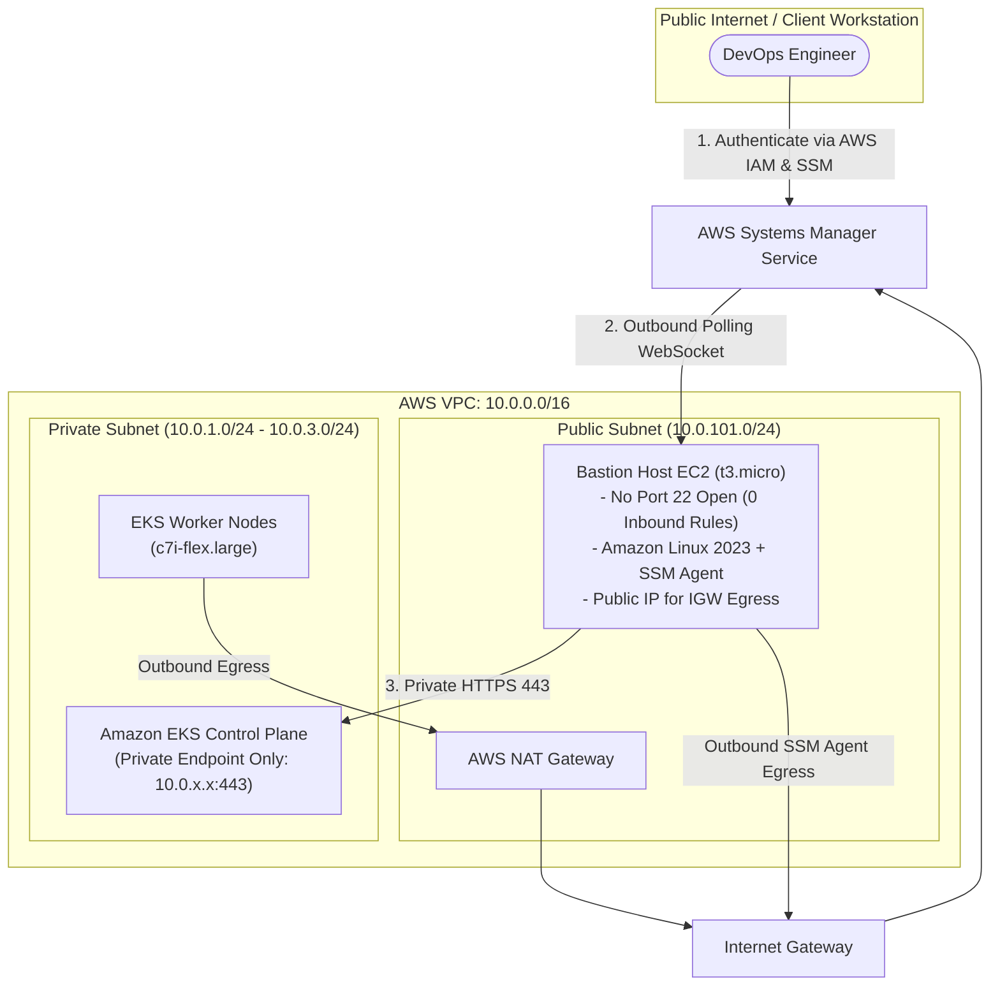

# Architecture Deep Dive 01: Private EKS Control Plane & Zero-Trust Bastion Routing

## Architectural Overview

| Domain | Architectural Decisions |
|---|---|
| **EKS Control Plane** | Isolated within VPC (`endpoint_public_access = false`, `endpoint_private_access = true`) |
| **Bastion Host Access** | Zero Open Inbound Ports via AWS Systems Manager (SSM) Session Manager |
| **Network Egress** | Direct Internet Gateway (IGW) route for SSM WebSocket polling |

---

## 1. The Architectural Challenge

In high-security enterprise environments, exposing the Kubernetes API server endpoint to the public internet presents a significant attack surface. To achieve compliance and defense-in-depth:
1. The EKS API endpoint must be strictly private (`endpoint_public_access = false`).
2. Engineers and administrators need secure, audited access without maintaining VPN concentrators or exposing SSH port 22 on a public IP.



---

## 2. Zero-Trust Bastion Security Design

### Elimination of Open SSH Ports
Traditional bastion jump hosts require open TCP port 22 exposed to the internet or restricted to dynamic IP CIDRs. This introduces:
- SSH key generation, distribution, and rotation overhead.
- Vulnerability to port scanning, brute force attacks, and SSH daemon zero-days.

**The Architectural Solution**:
- The Bastion host Security Group defines **0 inbound rules**.
- The Bastion host connects outbound to AWS Systems Manager endpoints over standard HTTPS/WSS (WebSocket).
- User authentication and authorization are managed centrally via AWS IAM policies.
- Every session and command is logged to AWS CloudTrail and Amazon CloudWatch for compliance auditing.

---

## 3. Public Subnet Routing & SSM Agent Egress

### The Routing Dilemma
When deploying the Bastion host in a **Public Subnet**:
- The Public Subnet's route table points `0.0.0.0/0` directly to the **Internet Gateway (IGW)**.
- An Internet Gateway requires a **1:1 Public IPv4 address translation** to route outbound packets over the internet.
- If the EC2 instance lacks a public IP, outbound TCP connection packets to `ssm.us-east-1.amazonaws.com` are dropped at the IGW because there is no routable return address.

### The Architectural Resolution
1. **Public IP Allocation**: Configure `associate_public_ip_address = true` in the Bastion EC2 definition.
2. **Strict Inbound Protection**: Maintain 0 inbound rules in the security group so the public IP cannot receive any unsolicited inbound traffic from the internet.
3. **Alternative Private Placement**: Alternatively, placing the Bastion in a private subnet routes traffic through the NAT Gateway (which holds an Elastic IP), eliminating the need for a direct public IP on the instance.

---

## 4. Verification & Operational Workflow

### Connect to Bastion
```bash
aws ssm start-session --target <BASTION_INSTANCE_ID> --region us-east-1
```

### Access Private EKS Cluster
Inside the SSM session:
```bash
aws eks update-kubeconfig --region us-east-1 --name atos-eks-cluster
kubectl get nodes -o wide
```
