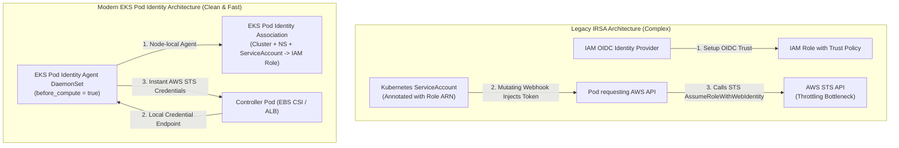

# Architecture Deep Dive 02: EKS Pod Identity & Addon Lifecycle Architecture

## Architectural Overview

| Domain | Architectural Decisions |
|---|---|
| **IAM Authentication for Pods** | Native AWS EKS Pod Identity Associations (replaces OIDC / IRSA) |
| **Addon Lifecycle** | Structured bootstrap ordering (`before_compute = true`) |
| **Storage & Controller Integration** | AWS EBS CSI Driver and AWS Load Balancer Controller |

---

## 1. The Architectural Evolution: Pod Identity vs Legacy IRSA

In Kubernetes on AWS, pods requiring access to AWS services (e.g., EBS CSI Driver creating EBS volumes, AWS Load Balancer Controller configuring ALBs) need temporary AWS IAM credentials.



### Key Advantages of Native EKS Pod Identity
1. **No OIDC Provider Provisioning**: Eliminates creating and maintaining an IAM OpenID Connect (OIDC) identity provider per cluster.
2. **Simplified Trust Policies**: IAM roles only require trust relationship with `pods.eks.amazonaws.com` instead of long OIDC issuer URLs.
3. **No Webhook Injection Latency**: Credentials are provided by a daemon running locally on the worker node.
4. **Declarative Terraform Management**: Managed directly through `aws_eks_pod_identity_association` resources.

---

## 2. Addon Lifecycle & Bootstrapping Sequence

### The Credential Dependency Challenge
EKS addons such as `aws-ebs-csi-driver` require AWS IAM permissions immediately upon pod scheduling to register CSI nodes and communicate with the Amazon EC2 EBS API.

If the controller pods schedule before IAM associations are established, or before the node-level agent is operational, the addon enters a health check failure loop.

### The Architectural Bootstrap Ordering
We enforce a strict layered bootstrap model in Terraform:

1. **Layer 1 (Core Cluster)**: EKS Control Plane + KMS Secret Encryption Key.
2. **Layer 2 (Core Addons - `before_compute = true`)**:
   - `vpc-cni`: Pre-configures pod network interfaces before user pods schedule.
   - `eks-pod-identity-agent`: Deploys the node-local daemonset responsible for serving pod credentials.
3. **Layer 3 (IAM Pod Identity Associations)**:
   - Associates `ebs-csi-controller-sa` in namespace `kube-system` to `${var.cluster_name}-ebs-csi-role`.
   - Associates `aws-load-balancer-controller` in namespace `kube-system` to `${var.cluster_name}-alb-controller-role`.
4. **Layer 4 (Compute & Worker Nodes)**: EKS Managed Node Group (`c7i-flex.large`).
5. **Layer 5 (Application Addons)**:
   - `aws-ebs-csi-driver`
   - `coredns`
   - `kube-proxy`

---

## 3. Implementation Specification

### EBS CSI Driver IAM Pod Identity
```hcl
module "ebs_csi_pod_identity" {
  source  = "terraform-aws-modules/eks-pod-identity/aws"
  version = "~> 1.0"

  name = "${var.cluster_name}-ebs-csi-role"

  attach_aws_ebs_csi_policy = true

  associations = {
    main = {
      cluster_name    = module.eks.cluster_name
      namespace       = "kube-system"
      service_account = "ebs-csi-controller-sa"
    }
  }
}
```

### Addon Definition in EKS Module
```hcl
addons = {
  coredns            = {}
  aws-ebs-csi-driver = {}
  eks-pod-identity-agent = {
    before_compute = true
  }
  kube-proxy = {}
  vpc-cni = {
    before_compute = true
  }
}
```

---

## 4. Verification

Verify that the Pod Identity agent and EBS CSI controller pods are healthy on the cluster:

```bash
# Check Pod Identity DaemonSet
kubectl get daemonset eks-pod-identity-agent -n kube-system

# Check EBS CSI Driver Deployment
kubectl get deployment ebs-csi-controller -n kube-system

# Check EBS StorageClass
kubectl get storageclass
```
