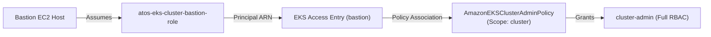

# Architecture Deep Dive 03: Kubernetes RBAC & Declarative EKS Access Entries

## Architectural Overview

| Domain | Architectural Decisions |
|---|---|
| **EKS Authentication** | AWS EKS Access Entries API (replaces `aws-auth` ConfigMap) |
| **Bastion RBAC Role** | `AmazonEKSClusterAdminPolicy` associated cluster-wide |
| **Cluster Creator Access** | `enable_cluster_creator_admin_permissions = true` |

---

## 1. The Architectural Evolution: Access Entries vs `aws-auth` ConfigMap

Historically, granting IAM users or roles access to an Amazon EKS cluster required editing a ConfigMap called `aws-auth` in the `kube-system` namespace.

```mermaid
flowchart TD
    subgraph Legacy_Auth ["Legacy aws-auth ConfigMap (Brittle)"]
        IAM_User1["AWS IAM Principal"] -->|"1. Authenticate with STS"| API1["EKS API Server"]
        API1 -->|"2. Read static ConfigMap"| AuthMap["ConfigMap: kube-system/aws-auth\n(Prone to syntax corruption & race conditions)"]
        AuthMap -->|"3. Match IAM ARN to RBAC Group"| K8s_RBAC1["Kubernetes RBAC RoleBinding"]
    end

    subgraph Modern_Access_Entries ["Modern EKS Access Entries API (Declarative & Resilient)"]
        IAM_User2["AWS IAM Principal (Bastion Role)"] -->|"1. Authenticate with STS"| API2["EKS API Server"]
        API2 -->|"2. Query AWS EKS Access Entry API"| AccessTable["EKS Access Entry Table\n(Native AWS Managed Control Plane API)"]
        AccessTable -->|"3. AmazonEKSClusterAdminPolicy"| K8s_RBAC2["Instant Cluster-Wide Admin Access"]
    end
```



### Limitations of `aws-auth` ConfigMap
- **Risk of Lockout**: A syntax error or malformed YAML string in `aws-auth` could completely lock all users and automation pipelines out of the cluster.
- **Race Conditions during Automation**: Simultaneous Terraform runs or helm updates modifying the ConfigMap could overwrite each other.
- **Out-of-Band Dependency**: Required the Kubernetes provider and `kubectl` to be configured inside Terraform before authentication entries could be added.

### Advantages of EKS Access Entries
- **AWS API Native**: Defined as standard AWS API resources (`aws_eks_access_entry` and `aws_eks_access_policy_association`).
- **Zero Kubernetes Provider Dependency**: Configurable entirely through the AWS Terraform provider without needing an active Kubernetes API provider block during initial provisioning.
- **Auditable via CloudTrail**: All authorization changes are logged through AWS IAM and CloudTrail.

---

## 2. Bastion IAM Role to Kubernetes RBAC Association

To allow administrators accessing the Bastion host via SSM to execute `kubectl` commands without credential rejection, we bind the Bastion IAM role directly in the EKS module:



---

## 3. Terraform Implementation Specification

### 1. Export Bastion Role ARN from Compute Module
In `modules/compute/outputs.tf`:
```hcl
output "bastion_role_arn" {
  description = "IAM Role ARN of the Bastion host"
  value       = aws_iam_role.bastion_role.arn
}
```

### 2. Configure Access Entry in EKS Module
In `modules/eks/main.tf`:
```hcl
access_entries = var.bastion_role_arn != null ? {
  bastion = {
    principal_arn     = var.bastion_role_arn
    kubernetes_groups = []

    policy_associations = {
      cluster_admin = {
        policy_arn = "arn:aws:eks::aws:cluster-access-policy/AmazonEKSClusterAdminPolicy"
        access_scope = {
          type = "cluster"
        }
      }
    }
  }
} : {}
```

---

## 4. Verification

Inside the Bastion host SSM session:

```bash
# Update kubeconfig context
aws eks update-kubeconfig --region us-east-1 --name atos-eks-cluster

# Verify RBAC authorization (Should return 200 OK without credential prompt)
kubectl auth can-i '*' '*' --all-namespaces
# Output: yes

# Query all namespaces
kubectl get namespaces
```
