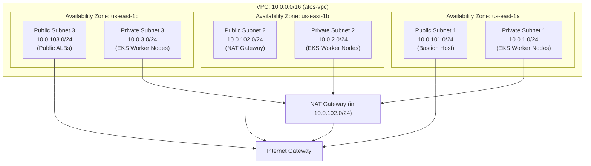

# Architecture Deep Dive 04: Multi-AZ Subnet Topology & Load Balancer Discovery

## Architectural Overview

| Domain | Architectural Decisions |
|---|---|
| **VPC CIDR & Topology** | `10.0.0.0/16` across 3 AZs (`us-east-1a`, `us-east-1b`, `us-east-1c`) |
| **Subnet Tiering** | 3 Private Subnets (`10.0.1.0/24` - `10.0.3.0/24`), 3 Public Subnets (`10.0.101.0/24` - `10.0.103.0/24`) |
| **Egress Architecture** | AWS Single NAT Gateway with Elastic IP |
| **Service Discovery** | Subnet tagging for AWS Load Balancer Controller |

---

## 1. Network Subnet Segmentation

The AWS VPC is partitioned into two distinct tiers across 3 Availability Zones for high availability, fault tolerance, and security isolation:



---

## 2. Kubernetes Load Balancer Auto-Discovery (ELB Tags)

When services or ingresses in Kubernetes request an external Application Load Balancer (ALB) or Network Load Balancer (NLB), the AWS Load Balancer Controller automatically queries AWS EC2 APIs to find which subnets to place the load balancers in.

### Subnet Tag Specifications
To enable auto-discovery:

1. **Public Subnets** (For Internet-Facing Load Balancers):
   ```hcl
   public_subnet_tags = {
     "kubernetes.io/role/elb"                    = "1"
     "kubernetes.io/cluster/${var.cluster_name}" = "shared"
   }
   ```

2. **Private Subnets** (For Internal Load Balancers):
   ```hcl
   private_subnet_tags = {
     "kubernetes.io/role/internal-elb"           = "1"
     "kubernetes.io/cluster/${var.cluster_name}" = "shared"
   }
   ```

---

## 3. Terraform VPC Implementation Specification

In `modules/vpc/main.tf`:
```hcl
module "vpc" {
  source  = "terraform-aws-modules/vpc/aws"
  version = "~> 6.6.0"

  name = var.vpc_name
  cidr = var.vpc_cidr

  azs             = var.azs
  private_subnets = var.private_subnets
  public_subnets  = var.public_subnets

  enable_nat_gateway = true
  single_nat_gateway = true

  public_subnet_tags = {
    "kubernetes.io/role/elb"                    = "1"
    "kubernetes.io/cluster/${var.cluster_name}" = "shared"
  }

  private_subnet_tags = {
    "kubernetes.io/role/internal-elb"           = "1"
    "kubernetes.io/cluster/${var.cluster_name}" = "shared"
  }

  tags = {
    Name      = "${var.cluster_name}-vpc"
    Terraform = "true"
  }
}
```

---

## 4. Verification

Verify that subnets carry the required discovery tags:

```bash
aws ec2 describe-subnets \
  --filters "Name=vpc-id,Values=<VPC_ID>" \
  --query "Subnets[*].{ID:SubnetId,CIDR:CidrBlock,Tags:Tags[?Key=='kubernetes.io/role/elb'||Key=='kubernetes.io/role/internal-elb'].Value}" \
  --output table
```
