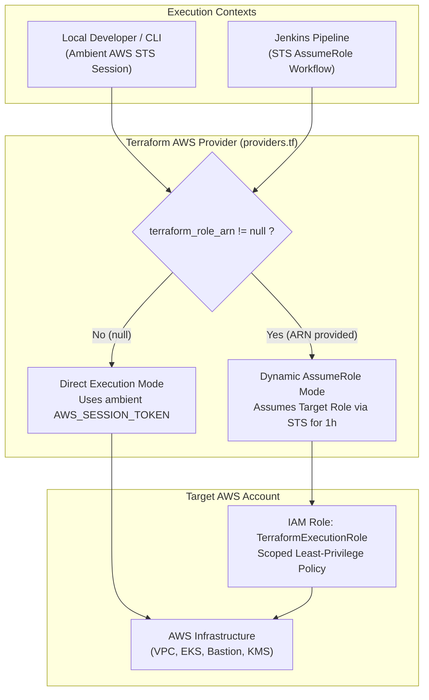

# Architecture 05: Temporary AWS Credentials & Dynamic Role Delegation in Terraform

## Executive Summary

Enterprise Infrastructure as Code (IaC) architectures strictly prohibit the use of permanent IAM user credentials (static `AKIA...` access keys) due to credential leakage risks, compliance violations, and lack of automatic rotation. 

This document details the architectural design implemented in the Terraform AWS provider configuration for **`AtosGraduationProject-infra`**, enabling seamless operation with **short-lived, ephemeral AWS Security Token Service (STS) credentials** across both automated CI/CD pipelines (Jenkins / JTE) and local developer environments.

---

## 1. Problem Statement: Static Keys vs. Ephemeral STS Sessions

### 1.1 The Vulnerability of Permanent IAM Credentials
Traditional CI/CD pipelines and developer workstations often relied on static IAM user access keys (`AKIA...` / `SecretAccessKey`). These keys:
- Never expire automatically.
- Present catastrophic blast radiuses if leaked in git history, build logs, or `.tfvars` files.
- Lack session-level auditability in AWS CloudTrail.

### 1.2 The Structure of Temporary AWS Credentials
Temporary credentials generated by AWS STS (e.g. via AWS Academy, IAM Identity Center / AWS SSO, or `sts:AssumeRole`) consist of three mandatory components:
1. `AWS_ACCESS_KEY_ID`: Prefixed with **`ASIA...`** (identifying a temporary session).
2. `AWS_SECRET_ACCESS_KEY`: Secret string.
3. `AWS_SESSION_TOKEN`: Ephemeral cryptographic token validating the STS session.

> [!WARNING]
> If `AWS_SESSION_TOKEN` is omitted when using an `ASIA...` key ID, Terraform and the AWS CLI will immediately fail with `InvalidClientTokenId` or `SignatureDoesNotMatch`.

---

## 2. Architectural Design: Dynamic `assume_role` Provider Block

To support both **direct ephemeral sessions** (e.g., local developer running temporary credentials directly) and **delegated execution roles** (e.g., Jenkins assuming a dedicated `TerraformExecutionRole`), Terraform leverages a dynamic provider configuration.



### 2.1 Provider Implementation (`providers.tf`)

```hcl
provider "aws" {
  region = var.aws_region

  dynamic "assume_role" {
    for_each = var.terraform_role_arn != null ? [var.terraform_role_arn] : []
    content {
      role_arn     = assume_role.value
      session_name = "TerraformProvisioningSession"
      duration     = "1h"
    }
  }

  default_tags {
    tags = {
      Project     = "AtosGraduationProject"
      Environment = var.environment
      Terraform   = "true"
    }
  }
}
```

### 2.2 Why `dynamic "assume_role"` with `for_each`?
Terraform does not support conditional top-level block syntax (e.g. `if / else`). The `dynamic` construct with a ternary operator achieves this:
- **When `var.terraform_role_arn` is `null`**: `for_each` receives an empty list `[]`. The `assume_role` block is completely omitted, allowing Terraform to use default ambient credentials.
- **When `var.terraform_role_arn` is provided**: `for_each` receives `[var.terraform_role_arn]`. Exactly one `assume_role` block is generated, forcing Terraform to request an STS session before executing plans or applies.

---

## 3. Variable Specification (`variables.tf`)

```hcl
variable "terraform_role_arn" {
  description = "Optional IAM Role ARN for Terraform to assume dynamically"
  type        = string
  default     = null
}
```

---

## 4. Execution Workflows

### 4.1 Local Developer Workflow (Ambient Temporary Credentials)
When running locally with temporary credentials (from AWS SSO, AWS Academy, or `aws configure`):

1. Export temporary credentials in the terminal:
   ```bash
   export AWS_ACCESS_KEY_ID="ASIA..."
   export AWS_SECRET_ACCESS_KEY="..."
   export AWS_SESSION_TOKEN="..."
   export AWS_DEFAULT_REGION="us-east-1"
   ```
2. Leave `terraform_role_arn = null` (default).
3. Execute Terraform directly:
   ```bash
   terraform init
   terraform plan
   ```

### 4.2 Automated CI/CD / Jenkins JTE Workflow
In automated pipelines, Jenkins generates a fresh 15-minute STS session and sets environment variables before executing Terraform:

```groovy
stage('Authenticate AWS (STS AssumeRole)') {
    steps {
        script {
            def stsOutput = sh(
                script: """
                    aws sts assume-role \
                        --role-arn "${ROLE_ARN}" \
                        --role-session-name "Jenkins-TF-${BUILD_NUMBER}" \
                        --duration-seconds 900 \
                        --query "Credentials.[AccessKeyId,SecretAccessKey,SessionToken]" \
                        --output text
                """,
                returnStdout: true
            ).trim().split('\\s+')

            env.AWS_ACCESS_KEY_ID     = stsOutput[0]
            env.AWS_SECRET_ACCESS_KEY = stsOutput[1]
            env.AWS_SESSION_TOKEN     = stsOutput[2]
        }
    }
}
```

---

## 5. Troubleshooting & Diagnostics

| Diagnostic Symptom | Root Cause | Resolution |
| :--- | :--- | :--- |
| `The security token included in the request is invalid` | The `AWS_ACCESS_KEY_ID` starts with `ASIA` but `AWS_SESSION_TOKEN` is missing or expired. | Ensure all 3 variables (`ACCESS_KEY`, `SECRET_KEY`, `SESSION_TOKEN`) are exported. |
| `The security token included in the request is expired` | The STS session exceeded its validity duration (e.g. 15m or 1h). | Refresh the session via `aws sts assume-role` or your SSO portal. |
| `AccessDenied: User is not authorized to perform: sts:AssumeRole on resource` | The trust policy on the target IAM Role does not allow the calling principal to assume it. | Verify that the target IAM Role's Trust Relationship allows `sts:AssumeRole` from your AWS Account / IAM Identity. |
