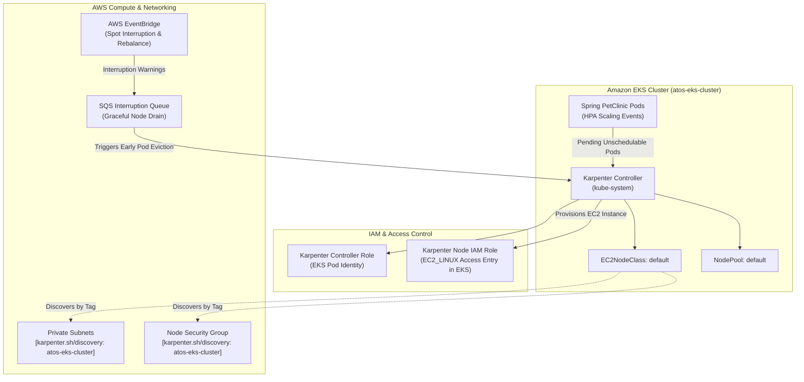

# Architecture 06: Karpenter High-Performance Autoscaling & Spot Interruption Architecture

## Executive Summary

To fulfill the requirements for **Horizontal Scaling**, **Vertical Scaling**, cost optimization, and high availability, the infrastructure leverages **Karpenter**—AWS's next-generation Kubernetes node autoscaler. 

Karpenter bypasses the latency and inflexibility of traditional Auto Scaling Groups (ASGs) by launching right-sized EC2 instances directly via EC2 Fleet APIs in ~40 seconds.

---

## 1. Architectural Components & Flow



---

## 2. Infrastructure Configuration in Terraform

### 2.1 Subnet & Security Group Discovery Tags
Karpenter discovers target subnets and security groups through the `karpenter.sh/discovery = <CLUSTER_NAME>` tag.

* **Private Subnets ([modules/vpc/main.tf](file:///home/devops/Atos/AtosGraduationProject-infra/modules/vpc/main.tf)):**
  ```hcl
  private_subnet_tags = {
    "kubernetes.io/role/internal-elb"           = "1"
    "kubernetes.io/cluster/${var.cluster_name}" = "shared"
    "karpenter.sh/discovery"                    = var.cluster_name
  }
  ```
* **Node Security Group ([modules/eks/main.tf](file:///home/devops/Atos/AtosGraduationProject-infra/modules/eks/main.tf)):**
  ```hcl
  node_security_group_tags = {
    "karpenter.sh/discovery" = var.cluster_name
  }
  ```

### 2.2 IAM & Interruption Handling ([modules/iam/karpenter.tf](file:///home/devops/Atos/AtosGraduationProject-infra/modules/iam/karpenter.tf))
Utilizes the official `terraform-aws-modules/eks/aws//modules/karpenter` submodule:
- Creates **Controller IAM Role** with scoped EC2 permissions bound via **EKS Pod Identity**.
- Creates **Node IAM Role** (`karpenter_node_role_name`) with `AmazonEKSWorkerNodePolicy`, `AmazonEKS_CNI_Policy`, `AmazonEC2ContainerRegistryReadOnly`, and `AmazonSSMManagedInstanceCore`.
- Creates **SQS Interruption Queue** with EventBridge rules for Spot termination warnings and capacity rebalance notifications.

---

## 3. GitOps & ArgoCD Installation Values

When installing Karpenter via ArgoCD Helm chart:

```yaml
settings:
  clusterName: atos-eks-cluster
  interruptionQueue: atos-eks-cluster-karpenter
```

### Declarative CRDs Managed in GitOps:

```yaml
apiVersion: karpenter.k8s.aws/v1
kind: EC2NodeClass
metadata:
  name: default
spec:
  amiFamily: AL2023
  role: atos-eks-cluster-karpenter-node-role
  subnetSelectorTerms:
    - tags:
        karpenter.sh/discovery: atos-eks-cluster
  securityGroupSelectorTerms:
    - tags:
        karpenter.sh/discovery: atos-eks-cluster
---
apiVersion: karpenter.sh/v1
kind: NodePool
metadata:
  name: default
spec:
  template:
    spec:
      nodeClassRef:
        group: karpenter.k8s.aws
        kind: EC2NodeClass
        name: default
      requirements:
        - key: "karpenter.sh/capacity-type"
          operator: In
          values: ["spot", "on-demand"]
        - key: "karpenter.k8s.aws/instance-family"
          operator: In
          values: ["c7i-flex", "t3", "m6i"]
  disruption:
    consolidationPolicy: WhenUnderutilized
```
