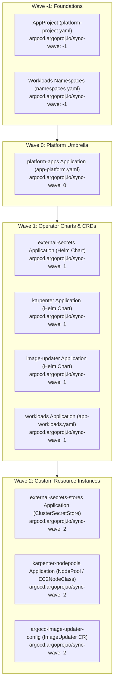

# Runbook 10: Argo CD Sync Waves, CRD Ordering & Dependency Race Conditions

## 1. Problem Description
During a clean cluster bootstrap (`gitops/bootstrap.sh`) or when syncing platform components, Argo CD operations fail with errors similar to:
```text
the server could not find the requested resource (post nodepools.karpenter.sh)
```
or:
```text
no matches for kind "NodePool" in version "karpenter.sh/v1"
```
or:
```text
no matches for kind "ClusterSecretStore" in version "external-secrets.io/v1beta1"
```
or:
```text
no matches for kind "ImageUpdater" in version "argocd.argoproj.io/v1alpha1"
```

The Application reports `SyncFailed` or enters a `Degraded` state during initial deployment.

---

## 2. Why This Happens: The Root Cause

This issue stems from **three interconnected behaviors** in Kubernetes and Argo CD:

### 1. The CRD Registration Race Condition
When an upstream Helm chart (such as Karpenter, External Secrets, or Image Updater) installs CustomResourceDefinitions (`installCRDs: true`), the Kubernetes API server must:
1. Commit the CRD definition into `etcd`.
2. Dynamically register the new API path (`/apis/<group>/<version>`).
3. Invalidate and rebuild the OpenAPI v3 discovery schema cache.

This process takes between 1 to 5 seconds. If custom resource manifests (e.g., `NodePool`, `EC2NodeClass`, `ClusterSecretStore`, or `ImageUpdater` CRs) are submitted in the same sync operation or evaluated simultaneously, the Kubernetes API server rejects them because the endpoint does not yet exist.

### 2. Client-Side Dry-Run Validation Denials
Before executing any sync wave, Argo CD runs a client-side validation (`kubectl apply --dry-run=client`) against its cached Kubernetes OpenAPI discovery schema. If a manifest references a Custom Resource whose CRD is not yet present in the cluster schema cache, **Argo CD aborts the entire sync cycle before Wave 0 or Wave 1 can even execute**.

### 3. Multi-Source Helm + Git Limitations
In earlier iterations, applications attempted to bundle upstream Helm charts with local Git YAML manifests in a single Application using multi-sources:
```yaml
# Problematic Pattern: Chart and CR in the same Application
sources:
  - repoURL: https://charts.external-secrets.io
    chart: external-secrets
  - repoURL: https://github.com/Abdelhamid108/AtosGraduationProject.git
    path: gitops/platform/external-secrets
    directory:
      include: "cluster-secret-store.yaml"
```
Because both sources belong to the same Application, Argo CD evaluates their manifests in a single wave, creating an inescapable bootstrap race.

### 4. Annotation Misplacement
In earlier configuration commits, `argocd.argoproj.io/sync-wave` was accidentally placed under `finalizers:` instead of `metadata.annotations:`:
```yaml
# BUG: Placed under finalizers!
metadata:
  name: platform-project
  finalizers:
    - resources-finalizer.argocd.argoproj.io
    - argocd.argoproj.io/sync-wave: "-1"  # Ignored by Argo CD!
```
Because it was not in `annotations:`, Argo CD assigned the default wave (`0`), breaking the intended initialization hierarchy.

---

## 3. The Architecture Solution: Two-Tier Sync Wave Hierarchy

To completely eliminate bootstrap race conditions, the platform implements a strict **Two-Tier Application Architecture** across root apps, projects, and platform operators.

### 3.1 Global Sync-Wave Hierarchy



---

## 4. Implementation Rules & Exact Configurations

### Rule 1: Split Chart and Custom Resources into Separate Applications
Never bundle a CRD-producing Helm chart with its custom resource manifests in the same `Application`. Split them into two distinct applications:

#### Tier 1: Operator Application (Wave "1")
```yaml
# gitops/platform/karpenter/application.yaml
apiVersion: argoproj.io/v1alpha1
kind: Application
metadata:
  name: karpenter
  namespace: argocd
  annotations:
    argocd.argoproj.io/sync-wave: "1"
spec:
  project: platform-project
  source:
    repoURL: oci://public.ecr.aws/karpenter
    chart: karpenter
    targetRevision: 1.14.1
    # ...
  syncPolicy:
    automated:
      prune: true
      selfHeal: true
    syncOptions:
      - CreateNamespace=true
      - SkipDryRunOnMissingResource=true
```

#### Tier 2: Custom Resources Application (Wave "2")
```yaml
# gitops/platform/karpenter/application.yaml (Second Document)
apiVersion: argoproj.io/v1alpha1
kind: Application
metadata:
  name: karpenter-nodepools
  namespace: argocd
  annotations:
    argocd.argoproj.io/sync-wave: "2"
spec:
  project: platform-project
  source:
    repoURL: "https://github.com/Abdelhamid108/AtosGraduationProject.git"
    targetRevision: main
    path: gitops/platform/karpenter
    directory:
      include: "nodepool.yaml"
  syncPolicy:
    automated:
      prune: true
      selfHeal: true
    syncOptions:
      - SkipDryRunOnMissingResource=true
```

### Rule 2: Always Enable `SkipDryRunOnMissingResource=true`
On all applications deploying custom resources, add `SkipDryRunOnMissingResource=true` under `spec.syncPolicy.syncOptions`. This bypasses client-side schema validation when the CRD has not yet been registered during initial template evaluation.

### Rule 3: Enforce Strict Metadata Annotation Placement
Ensure the sync-wave annotation is placed strictly under `metadata.annotations`:
```yaml
metadata:
  annotations:
    argocd.argoproj.io/sync-wave: "1"  # CORRECT
```
Do NOT place it under `finalizers:`, `spec:`, or `labels:`.

---

## 5. Diagnostic Commands & Runbook Procedures

### Step 1: Inspect Sync Wave Order Across All Applications
Verify that waves are ordered correctly in your live cluster:
```bash
kubectl get applications.argoproj.io -n argocd -o custom-columns=\
NAME:.metadata.name,\
WAVE:.metadata.annotations.'argocd\.argoproj\.io/sync-wave',\
STATUS:.status.sync.status,\
HEALTH:.status.health.status
```
Expected output:
```text
NAME                            WAVE    STATUS    HEALTH
platform-project                -1      Synced    Healthy
platform-apps                   0       Synced    Healthy
karpenter                       1       Synced    Healthy
external-secrets                1       Synced    Healthy
image-updater                   1       Synced    Healthy
workloads                       1       Synced    Healthy
karpenter-nodepools             2       Synced    Healthy
external-secrets-stores         2       Synced    Healthy
argocd-image-updater-config     2       Synced    Healthy
```

### Step 2: Verify CRD Registration in Kubernetes
Check whether the required CRDs have been accepted by the API server:
```bash
kubectl get crd | grep -E "karpenter|external-secrets|argoproj"
```
Verify that the CRD is in the `Established` condition:
```bash
kubectl get crd nodepools.karpenter.sh -o jsonpath='{.status.conditions[?(@.type=="Established")].status}'
# Expected output: True
```

### Step 3: Clear Stale Argo CD Discovery Cache (When Retrying)
If Argo CD cached an empty schema during a failed sync, force it to invalidate its OpenAPI discovery cache:
```bash
# Hard refresh the target application
argocd app get karpenter-nodepools --hard-refresh

# Alternatively, bounce the argocd-repo-server pod to force discovery cache rebuild
kubectl rollout restart deployment argocd-repo-server -n argocd
```

### Step 4: Manually Trigger Ordered Sync Sequence
If bootstrap is halted on a fresh cluster, manually sync applications wave by wave:
```bash
# 1. Sync the foundational project
argocd app sync platform-project

# 2. Sync the platform operators (Wave 1)
argocd app sync karpenter external-secrets image-updater

# 3. Wait for CRDs to be established, then sync custom resources (Wave 2)
argocd app sync karpenter-nodepools external-secrets-stores argocd-image-updater-config
```
