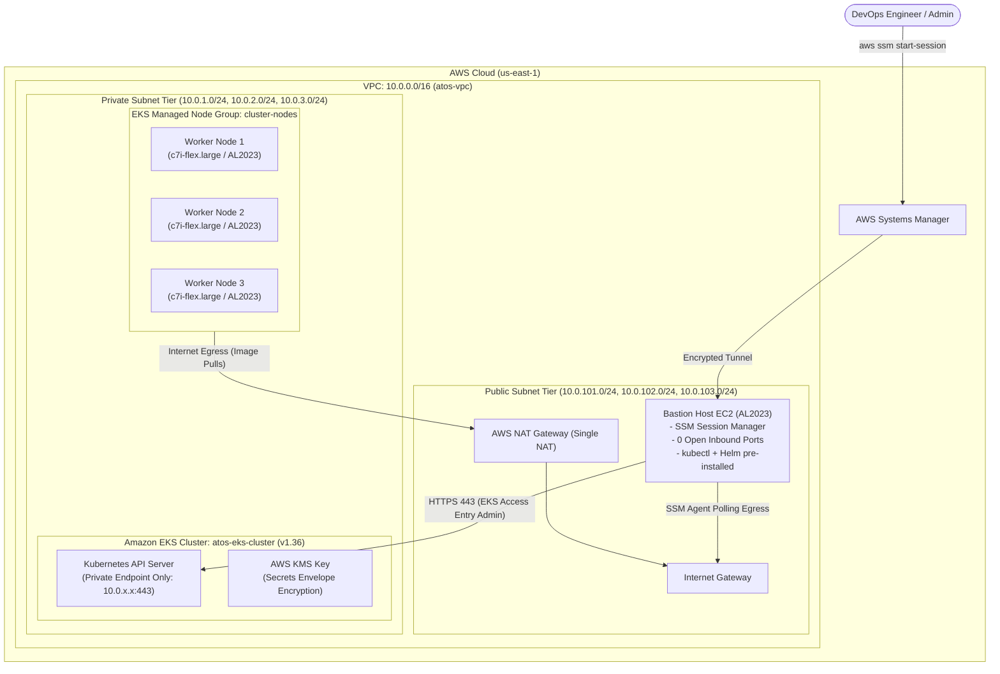

# Atos Graduation Project — Infrastructure as Code (IaC)

[](https://www.terraform.io/)
[](https://registry.terraform.io/providers/hashicorp/aws/latest)
[](https://aws.amazon.com/eks/)
[](LICENSE)

Production-grade Infrastructure as Code (IaC) repository provisioning an enterprise-ready, isolated **Amazon Elastic Kubernetes Service (EKS)** cluster on AWS using modular **Terraform**, **AWS Systems Manager (SSM) Bastion Host**, **EKS Pod Identity Associations**, and **EKS Access Entries**.

---

## Architecture Overview

The infrastructure implements a **Zero Trust / Private Endpoint** security model. The EKS Control Plane API is isolated within the internal VPC network, with administration brokered strictly through an IAM-authenticated Bastion Host managed via AWS Systems Manager.



For complete technical specifications, see [docs/architecture.md](docs/architecture.md).

---

## Key Features & Security Posture

- **Zero-Open-Port Bastion Host**: Eliminates SSH key management and port 22 vulnerabilities. Access is managed through AWS Systems Manager Session Manager.
- **Private EKS Control Plane**: Public API endpoint is disabled (`endpoint_public_access = false`).
- **EKS Pod Identity Associations**: Modern IAM credential management replacing complex OIDC / IRSA with native EKS Pod Identity associations for EBS CSI Driver and AWS Load Balancer Controller.
- **Declarative EKS Access Entries**: Explicit cluster RBAC mapping using AWS IAM Roles and `AmazonEKSClusterAdminPolicy`.
- **Envelope Encryption for Secrets**: Kubernetes secrets are encrypted at rest using an AWS KMS Customer Managed Key.
- **High-Availability Multi-AZ**: 3 Public subnets (`10.0.101.0/24` - `10.0.103.0/24`) and 3 Private subnets (`10.0.1.0/24` - `10.0.3.0/24`) across `us-east-1a`, `us-east-1b`, and `us-east-1c`.

---

## Repository Structure

```
AtosGraduationProject-infra/
├── main.tf                      # Root module orchestrating VPC, IAM, Compute, and EKS
├── ecr.tf                       # Amazon ECR repository with automated security scanning & lifecycle
├── variables.tf                 # Global input variables
├── outputs.tf                   # Root output parameters & connection commands
├── providers.tf                 # AWS and Terraform provider constraints
├── terraform.tfvars.example     # Template variable configuration
├── terraform.tfvars             # Local working configuration (gitignored)
├── .gitignore                   # Comprehensive state and secret exclusions
├── LICENSE                      # MIT License
├── modules/
│   ├── vpc/                     # Multi-AZ VPC with Public/Private subnets & NAT GW
│   │   ├── main.tf
│   │   ├── variables.tf
│   │   └── outputs.tf
│   ├── iam/                     # Centralized IAM Roles, SSM policies, & EKS Pod Identities
│   │   ├── bastion.tf
│   │   ├── pod_identity.tf
│   │   ├── variables.tf
│   │   └── outputs.tf
│   ├── compute/                 # SSM Bastion host EC2 instance
│   │   ├── main.tf
│   │   ├── security.tf
│   │   ├── variables.tf
│   │   └── outputs.tf
│   └── eks/                     # EKS Cluster, Node Groups, and Karpenter Autoscaler
│       ├── main.tf
│       ├── karpenter.tf
│       ├── variables.tf
│       └── outputs.tf
└── docs/
    ├── architecture.md          # Comprehensive architectural specification
    └── troubleshooting/         # Architectural knowledge base & design decisions
        ├── README.md
        ├── 01-private-cluster-control-plane-and-bastion-architecture.md
        ├── 02-eks-pod-identity-and-addon-lifecycle-architecture.md
        ├── 03-kubernetes-rbac-and-declarative-access-entries-architecture.md
        ├── 04-multi-az-subnet-topology-and-load-balancer-discovery.md
        ├── 05-temporary-credentials-and-dynamic-role-delegation.md
        └── 06-karpenter-autoscaling-and-spot-interruption-architecture.md
```

---

## Terraform Variables Reference

| Variable Name | Type | Default Value | Description |
|---|---|---|---|
| `aws_region` | `string` | `"us-east-1"` | AWS region to deploy resources in |
| `environment` | `string` | `"Prod"` | Environment name |
| `cluster_name` | `string` | `"atos-eks-cluster"` | Name of the EKS cluster |
| `cluster_version` | `string` | `"1.36"` | Kubernetes version for the EKS cluster |
| `vpc_name` | `string` | `"atos-vpc"` | Name of the VPC |
| `vpc_cidr` | `string` | `"10.0.0.0/16"` | CIDR block for the VPC |
| `azs` | `list(string)` | `["us-east-1a", "us-east-1b", "us-east-1c"]` | List of Availability Zones |
| `private_subnets` | `list(string)` | `["10.0.1.0/24", "10.0.2.0/24", "10.0.3.0/24"]` | List of CIDR blocks for private subnets |
| `public_subnets` | `list(string)` | `["10.0.101.0/24", "10.0.102.0/24", "10.0.103.0/24"]` | List of CIDR blocks for public subnets |
| `ami_type` | `string` | `"AL2023_x86_64_STANDARD"` | AMI type for EKS worker nodes |
| `instance_types` | `list(string)` | `["c7i-flex.large"]` | Instance types for EKS worker nodes |
| `min_size` | `number` | `2` | Minimum number of worker nodes |
| `max_size` | `number` | `4` | Maximum number of worker nodes |
| `desired_size` | `number` | `3` | Desired number of worker nodes |
| `bastion_instance_type` | `string` | `"t3.micro"` | EC2 instance type for the Bastion jump host |
| `terraform_role_arn` | `string` | `null` | Optional IAM Role ARN for Terraform to assume dynamically via STS |

---

## Terraform Outputs Reference

| Output Name | Description | Example / Usage |
|---|---|---|
| `vpc_id` | ID of the created VPC | `vpc-08ce27ada1582de86` |
| `public_subnets` | List of public subnet IDs | `["subnet-xxx", ...]` |
| `private_subnets` | List of private subnet IDs | `["subnet-yyy", ...]` |
| `cluster_name` | Kubernetes Cluster Name | `atos-eks-cluster` |
| `cluster_endpoint` | Private API server endpoint URL | `https://xxxx.gr7.us-east-1.eks.amazonaws.com` |
| `bastion_instance_id` | Instance ID of the Bastion host | `i-0c3ce16392e6ba3ac` |
| `ssm_connect_command` | AWS CLI command to connect to Bastion | `aws ssm start-session --target i-0c3ce16392e6ba3ac` |
| `kubeconfig_update_command` | AWS CLI command to update kubeconfig | `aws eks update-kubeconfig --region us-east-1 --name atos-eks-cluster` |

---

## Prerequisites

Ensure the following tools are installed on your administration workstation:

1. **Terraform** (`>= 1.5.0`): [Install Terraform](https://developer.hashicorp.com/terraform/downloads)
2. **AWS CLI** (`>= 2.0`): [Install AWS CLI](https://docs.aws.amazon.com/cli/latest/userguide/getting-started-install.html)
3. **AWS Session Manager Plugin**:
   ```bash
   # Debian / Ubuntu
   curl "https://s3.amazonaws.com/session-manager-downloads/plugin/latest/ubuntu_64bit/session-manager-plugin.deb" -o "session-manager-plugin.deb"
   sudo dpkg -i session-manager-plugin.deb
   rm session-manager-plugin.deb
   ```
4. **AWS IAM Credentials**:
   ```bash
   aws configure
   ```

---

## Deployment Guide

### Step 1: Clone Repository & Configure Variables
```bash
git clone <YOUR_INFRA_REPO_URL>
cd AtosGraduationProject-infra

# Copy template variables
cp terraform.tfvars.example terraform.tfvars
```

### Step 2: Initialize Terraform Modules & Providers
```bash
terraform init
```

### Step 3: Review Execution Plan
```bash
terraform plan
```

### Step 4: Provision Infrastructure
```bash
terraform apply
```
*Provisioning completes in approximately 12–15 minutes.*

---

## Accessing and Operating the Cluster

Because the EKS API server endpoint is private, management is performed through the SSM Bastion host.

### 1. Connect to the Bastion Host
```bash
aws ssm start-session --target $(terraform output -raw bastion_instance_id) --region us-east-1
```

### 2. Configure Kubeconfig on the Bastion
Inside the SSM shell session:
```bash
aws eks update-kubeconfig --region us-east-1 --name atos-eks-cluster
```

### 3. Verify Worker Nodes and Core System Pods
```bash
# Check worker nodes
kubectl get nodes -o wide

# Check system pods
kubectl get pods -n kube-system

# Verify EBS CSI Driver pods
kubectl get pods -n kube-system -l app.kubernetes.io/name=aws-ebs-csi-driver
```

---

## Architecture Knowledge Base

Detailed architectural decisions, networking flows, and security designs:

- **[Architecture 01: Private Control Plane & Zero-Trust Bastion](docs/troubleshooting/01-private-cluster-control-plane-and-bastion-architecture.md)** — Private API isolation, elimination of port 22 SSH, and SSM WebSocket routing.
- **[Architecture 02: EKS Pod Identity & Addon Lifecycle](docs/troubleshooting/02-eks-pod-identity-and-addon-lifecycle-architecture.md)** — Native Pod Identity vs legacy IRSA, and `before_compute` addon ordering.
- **[Architecture 03: Kubernetes RBAC & EKS Access Entries](docs/troubleshooting/03-kubernetes-rbac-and-declarative-access-entries-architecture.md)** — Declarative Access Entry API and IAM role mapping to `AmazonEKSClusterAdminPolicy`.
- **[Architecture 04: Multi-AZ Subnet Topology & Load Balancer Discovery](docs/troubleshooting/04-multi-az-subnet-topology-and-load-balancer-discovery.md)** — Subnet allocation and discovery tagging for AWS Load Balancer Controller.
- **[Architecture 05: Temporary Credentials & Dynamic Role Delegation](docs/troubleshooting/05-temporary-credentials-and-dynamic-role-delegation.md)** — Ephemeral AWS STS sessions (`ASIA...`), zero permanent keys, and dynamic `assume_role` provider delegation.
- **[Architecture 06: Karpenter Autoscaling & Spot Interruption](docs/troubleshooting/06-karpenter-autoscaling-and-spot-interruption-architecture.md)** — Karpenter controller Pod Identity, Subnet/SG discovery, Node Access Entries, and SQS EventBridge interruption queue.

Explore the full index in [docs/troubleshooting/README.md](docs/troubleshooting/README.md).

---

## Teardown & Cost Management

To destroy all cloud resources and stop ongoing AWS charges:

```bash
terraform destroy
```

---

## License
This project is licensed under the MIT License — see the [LICENSE](LICENSE) file for details.
