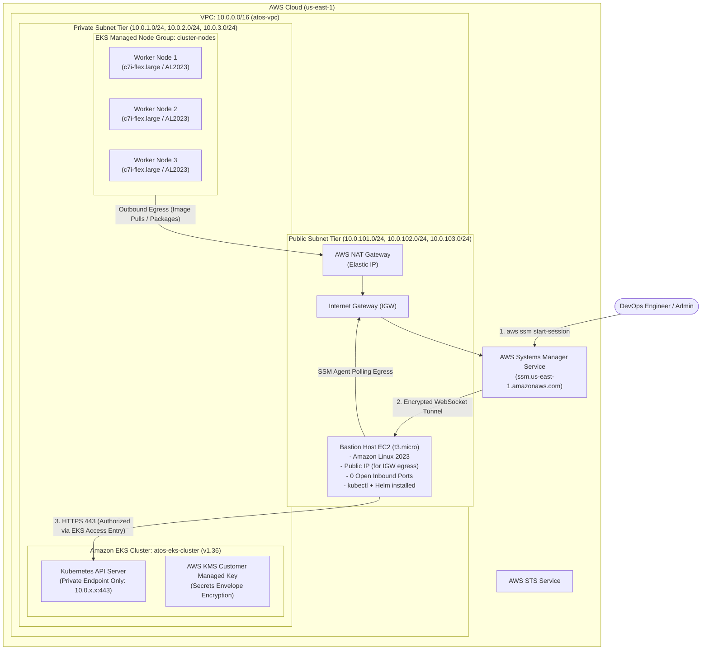
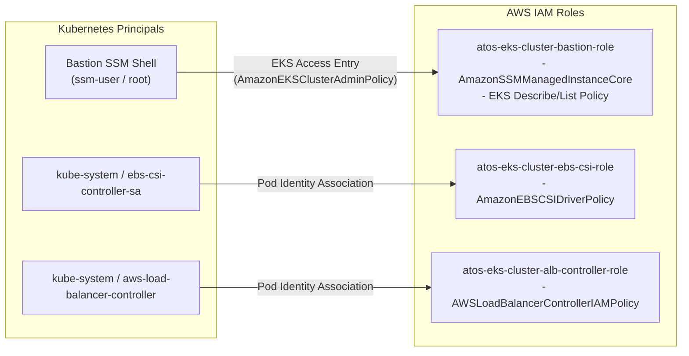

# Infrastructure Architecture & Technical Specification

This document provides a comprehensive technical breakdown of the AWS and Kubernetes infrastructure provisioned by this Terraform repository.

---

## 1. Architectural Principles & Security Model

The design implements the following enterprise cloud architecture and DevSecOps principles:

1. **Zero Trust & Zero Open Inbound Ports**:
   - The Bastion host operates with **0 open inbound rules** in its Security Group.
   - Traditional SSH over port 22 is completely disabled, eliminating SSH key lifecycle management and public port vulnerability scanning.
   - Inbound administrative access is brokered strictly via authenticated, encrypted AWS Systems Manager (SSM) WebSocket tunnels.

2. **Strict Private Control Plane Isolation**:
   - The Amazon EKS control plane API endpoint is configured with `endpoint_public_access = false` and `endpoint_private_access = true`.
   - The Kubernetes API server is reachable only from within the VPC network (specifically from the Bastion host and worker nodes).

3. **Modern IAM Authentication (EKS Access Entries)**:
   - Replaces the legacy `aws-auth` ConfigMap with declarative **EKS Access Entries**.
   - The Bastion host IAM role is assigned `AmazonEKSClusterAdminPolicy` scoped cluster-wide.

4. **Native IAM Pod Identity Associations**:
   - Eliminates OIDC provider setup and IRSA annotation complexities by leveraging native EKS Pod Identity agents for the EBS CSI Driver and AWS Load Balancer Controller.

5. **Envelope Encryption for Secrets**:
   - All Kubernetes Secrets are encrypted at rest using an AWS KMS Customer Managed Key (CMK) provisioned with automatic rotation.

6. **Multi-AZ High Availability**:
   - Subnets and EKS Managed Node Groups span 3 Availability Zones (`us-east-1a`, `us-east-1b`, `us-east-1c`).

---

## 2. Architecture Diagram

---

## 3. Network Topology & Subnet Allocation

| Subnet Name | Type | CIDR Block | AZ | Route Table Target (`0.0.0.0/0`) | Kubernetes Discovery Tags |
|---|---|---|---|---|---|
| `atos-vpc-public-us-east-1a` | Public | `10.0.101.0/24` | `us-east-1a` | Internet Gateway (`igw-xxxx`) | `kubernetes.io/role/elb = 1` `kubernetes.io/cluster/atos-eks-cluster = shared` |
| `atos-vpc-public-us-east-1b` | Public | `10.0.102.0/24` | `us-east-1b` | Internet Gateway (`igw-xxxx`) | `kubernetes.io/role/elb = 1` `kubernetes.io/cluster/atos-eks-cluster = shared` |
| `atos-vpc-public-us-east-1c` | Public | `10.0.103.0/24` | `us-east-1c` | Internet Gateway (`igw-xxxx`) | `kubernetes.io/role/elb = 1` `kubernetes.io/cluster/atos-eks-cluster = shared` |
| `atos-vpc-private-us-east-1a` | Private | `10.0.1.0/24` | `us-east-1a` | NAT Gateway (`nat-xxxx`) | `kubernetes.io/role/internal-elb = 1` `kubernetes.io/cluster/atos-eks-cluster = shared` |
| `atos-vpc-private-us-east-1b` | Private | `10.0.2.0/24` | `us-east-1b` | NAT Gateway (`nat-xxxx`) | `kubernetes.io/role/internal-elb = 1` `kubernetes.io/cluster/atos-eks-cluster = shared` |
| `atos-vpc-private-us-east-1c` | Private | `10.0.3.0/24` | `us-east-1c` | NAT Gateway (`nat-xxxx`) | `kubernetes.io/role/internal-elb = 1` `kubernetes.io/cluster/atos-eks-cluster = shared` |

---

## 4. Security Group Matrix

| Security Group | Direction | Protocol | Port Range | Source / Destination | Purpose |
|---|---|---|---|---|---|
| **Bastion SG** (`atos-eks-cluster-bastion-sg`) | Ingress | - | - | **None (0 rules)** | SSM requires no open inbound ports |
| | Egress | All | All | `0.0.0.0/0` | Egress to AWS SSM APIs, updates, and cluster API |
| **Cluster SG** (`atos-eks-cluster-cluster-xxxx`) | Ingress | TCP | 443 | Bastion SG (`atos-eks-cluster-bastion-sg`) | Direct HTTPS kubectl access from Bastion |
| | Ingress | TCP | 443 | Node SG | Worker nodes communicating with API server |
| | Egress | All | All | `0.0.0.0/0` | Control plane egress |
| **Node SG** (`atos-eks-cluster-node-xxxx`) | Ingress | TCP/UDP | 53 | Node SG | CoreDNS pod communication |
| | Ingress | TCP | 443, 10250 | Cluster SG | Kubelet and webhook traffic from control plane |
| | Egress | All | All | `0.0.0.0/0` | Pod internet egress via NAT Gateway |

---

## 5. IAM Roles & Pod Identity Architecture

---

## 6. EKS Addons & Bootstrapping Order

The cluster provisions managed addons configured with precise bootstrap ordering:

| Addon Name | Version Constraint | Bootstrap Ordering | Role / Authentication |
|---|---|---|---|
| `vpc-cni` | Managed latest | `before_compute = true` | Node IAM Role |
| `eks-pod-identity-agent` | Managed latest | `before_compute = true` | DaemonSet on all nodes |
| `kube-proxy` | Managed latest | Standard | Managed by EKS |
| `coredns` | Managed latest | Standard | Managed by EKS |
| `aws-ebs-csi-driver` | Managed latest | Standard | EKS Pod Identity (`ebs-csi-controller-sa`) |

---

## 7. Bastion Automation & Pre-installed Tooling

The Bastion host is bootstrapped via EC2 User Data (`modules/compute/main.tf`):
- **Base packages**: `git`, `curl`, `tar`, `gzip`, `jq`
- **Kubernetes CLI (`kubectl`)**: Latest stable binary installed to `/usr/local/bin/kubectl`
- **Helm 3**: Installed via official Helm installation script
- **Productivity**: Bash alias `k=kubectl` configured for both `ec2-user` and `root`
