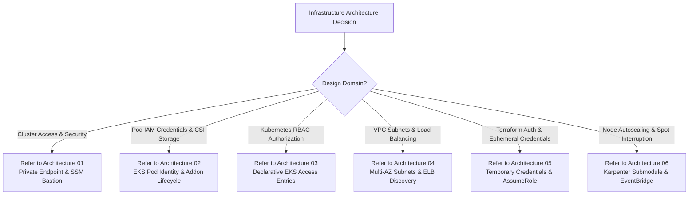

# Infrastructure Architecture & Design Knowledge Base

This directory documents in-depth architectural analyses, security boundaries, and infrastructure patterns designed and validated for this Amazon EKS & AWS infrastructure.

---

## Architectural Deep Dive Directory

| ID | Architectural Domain & Focus | Key Challenges & Decisions | Reference Document |
|---|---|---|---|
| **01** | **Private Control Plane & Zero-Trust Bastion** | Private API isolation, elimination of port 22 SSH, AWS SSM Session Manager WebSocket tunnels, and public subnet IGW routing. | [01-private-cluster-control-plane-and-bastion-architecture.md](01-private-cluster-control-plane-and-bastion-architecture.md) |
| **02** | **EKS Pod Identity & Addon Lifecycle** | Migration from legacy OIDC/IRSA to native EKS Pod Identity Associations, and bootstrap ordering (`before_compute = true`) for EBS CSI Driver and VPC CNI. | [02-eks-pod-identity-and-addon-lifecycle-architecture.md](02-eks-pod-identity-and-addon-lifecycle-architecture.md) |
| **03** | **Kubernetes RBAC & EKS Access Entries** | Modern declarative EKS Access Entry API replacing brittle `aws-auth` ConfigMaps, bridging Bastion IAM role directly to `AmazonEKSClusterAdminPolicy`. | [03-kubernetes-rbac-and-declarative-access-entries-architecture.md](03-kubernetes-rbac-and-declarative-access-entries-architecture.md) |
| **04** | **Multi-AZ Subnet Topology & Load Balancer Discovery** | Multi-tier subnet segmentation across 3 AZs (`10.0.1.0/24` - `10.0.3.0/24` private, `10.0.101.0/24` - `10.0.103.0/24` public) with ELB discovery tagging. | [04-multi-az-subnet-topology-and-load-balancer-discovery.md](04-multi-az-subnet-topology-and-load-balancer-discovery.md) |
| **05** | **Temporary Credentials & Dynamic Role Delegation** | Zero permanent IAM keys, ephemeral AWS STS sessions (`ASIA...` + `AWS_SESSION_TOKEN`), and dynamic `assume_role` provider delegation. | [05-temporary-credentials-and-dynamic-role-delegation.md](05-temporary-credentials-and-dynamic-role-delegation.md) |
| **06** | **Karpenter Autoscaling & Spot Interruption** | High-performance direct EC2 node provisioning, Subnet/SG discovery tagging, EKS Pod Identity controller permissions, and SQS EventBridge interruption queue. | [06-karpenter-autoscaling-and-spot-interruption-architecture.md](06-karpenter-autoscaling-and-spot-interruption-architecture.md) |

---

## Architecture Diagnostic Flowchart

